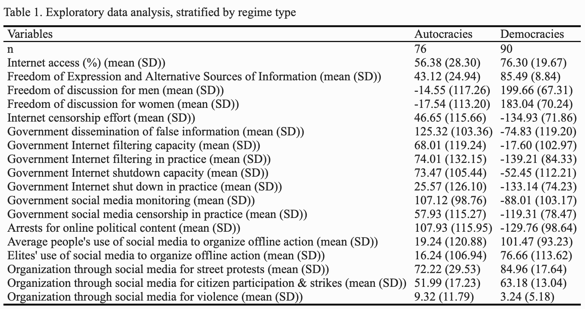
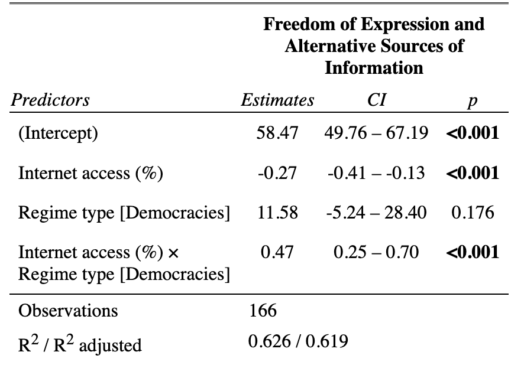
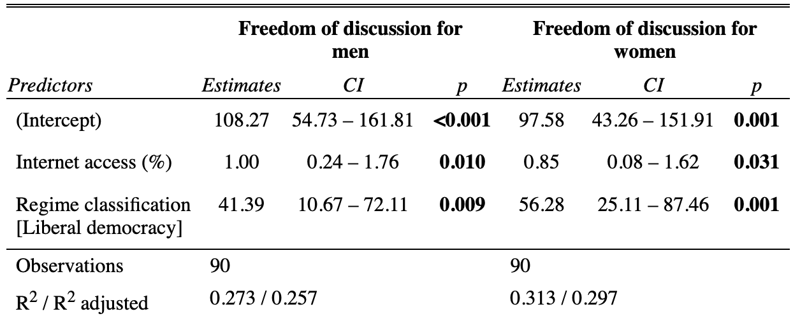

```{r setup, include=FALSE}
knitr::opts_chunk$set(echo = TRUE)
```

## Intro

A growing body of literature has been interested in the effect of the rise and diffusion of new technologies on international relations. One particular topic of contention is the relationship between internet use, especially activity on social networks, and civil liberties. 

Social media platforms have fundamentally transformed the landscape of social and political movements. They have allowed individuals to bypass traditional gatekeepers of information, such as the mainstream media, and connect with each other directly. This has enabled dissidents to spread information and organize more quickly and effectively than ever before. The other side of the coin is that they also enabled certain governments to better monitor and gather information, potentially putting activists at risk.

Through a combination of data analysis and case studies, this report seeks to further uncover the nature of the effect of the development of the internet and social media on freedom of speech and activism.  

## Dataset & Methodology

For this research project, a dataset on internet penetration, V-Dem indicators, and the political environment of the internet and social media was compiled for 179 countries.

- **Internet penetration**: The [International Telecommunication Union (ITU)](https://www.itu.int/en/Pages/default.aspx) is the UN specialized agency for information and communications technologies (ICT), and the official source for global ICT [statistics](https://www.itu.int/en/ITU-D/Statistics/Pages/stat/default.aspx). These statistics include the percentage of the population having access to the internet, broken down by gender and urban/rural area, at country level. 

- **Measure of democracy**: The [Varieties of Democracy Dataset, version 13](https://www.v-dem.net/data/the-v-dem-dataset/) measures democracy and many of its indicators in the set of countries studied. It also includes the Regimes of the World (RoW) variable that was used to classify regime types for this project. 

- **Political environment of the internet and social media**: Through expert-coded surveys, the Digital Society Survey, designed by the [Digital Society Project](http://digitalsocietyproject.org), provides information on topics related to coordinated information operations, digital media freedom, online media polarization, social cleavages as well as state internet regulation capacity and approach. 

```{r loading, include=FALSE}
library(tidyverse)
library(ggplot2)
library(ggthemes)
library(ggrepel)
library(scales)
library(stargazer)


df <- read_csv("data/final_data.csv")

#final variable selection
df_reduced <- df %>% 
  select(Economy, #countries
         most_recent_perc,  #internet access(%)
         v2x_regime,  #regime classification (4)
         v2x_freexp_altinf, #freedom of Expression and Alternative Sources of Information index
         v2cldiscm, #freedom of discussion for men
         v2cldiscw,  #freedom of discussion for women
         v2mecenefi, #Internet censorship effort (higher = less censorship)
         v2smgovdom, #Government dissemination of false information domestic (higher = less dissemination)
         v2smgovfilcap, #Government Internet filtering capacity
         v2smgovfilprc, #Government Internet filtering in practice (high = less often)
         v2smgovshutcap, #Government Internet shutdown capacity
         v2smgovshut, #Government Internet shut down in practice (high = less often)
         v2smgovsmmon, #Government social media monitoring  (high = less monitoring)
         v2smgovsmcenprc, #Government social media censorship in practice  (high = less censorship)
         v2smarrest, #Arrests for online political content (high = less likely)
         v2smorgavgact, #Average people’s use of social media to organize offline action
         v2smorgelitact, #Elites’ use of social media to organize offline action
         #Types of organization through social media
         v2smorgtypes_0, #Petition signing
         v2smorgtypes_1, #Voter turnout 
         v2smorgtypes_2, #Street protests
         v2smorgtypes_3, #Strikes/labor actions
         v2smorgtypes_6, #Vigilante Justice
         v2smorgtypes_7, #Terrorism
         v2smorgtypes_8)%>%#Ethnic cleansing/genocide
  #recode sm. org. type --> merge categories
  mutate(smorg_particip = round((v2smorgtypes_0 + v2smorgtypes_1 + v2smorgtypes_3)/3, 3), #citizen participation & strikes
         smorg_violence =  round((v2smorgtypes_6 + v2smorgtypes_7 + v2smorgtypes_8)/3, 3)) %>% 
  #variables for capacity coded in the opposite way as variables for gvt action: reverse code them
  mutate(v2smgovfilcap = -1*v2smgovfilcap,
         v2smgovshutcap = -1*v2smgovshutcap)%>%
  #new variable for regimes
  mutate(v2x_regime = as.factor(v2x_regime),
         regime_type = as.factor(ifelse(grepl("autocracy", v2x_regime), "Autocracies", "Democracies")))%>% 
  rename(smorg_st_protests = v2smorgtypes_2)%>%
  select(-v2smorgtypes_0, -v2smorgtypes_1, -v2smorgtypes_3, -v2smorgtypes_6, -v2smorgtypes_7, -v2smorgtypes_8)

#scale all variables to 0-100
df_transformed <- df_reduced  %>% 
  mutate_if(is.numeric, ~ . * 100)

```

#### Types of political systems

This report tackles the differences in the impact of the internet on civil liberties, especially freedom of expression, across different types of regimes. To classify them, we will use the Regimes of the World (RoW) data by political scientists Anna Lührmann, Marcus Tannenberg, and Staffan Lindberg, published by the Varieties of Democracy (V-Dem) project. The RoW data distinguishes four types of political systems based on how their elections work and other factors related to how their government functions. 

- closed autocracies
- electoral autocracies
- electoral democracies
- liberal democracies

One strength of using the RoW data is that it is based on evaluations by experts, who are primarily academics, members of the media, and civil society, and often nationals or residents of the country they assess. This allows for a nuanced and informed assessment of a country's political system. Additionally, V-Dem uses several experts per country, year, and topic, to make its assessments less subjective, which further increases the reliability of the data.

However, a weakness of using expert evaluations is that they are to some degree subjective, and there may be disagreement about specific characteristics or how something as complex as a political system can be reduced into a single measure. V-Dem addresses this by using several experts and specific questions on completely explained scales.

Overall, the use of the RoW data is a valid and [widely accepted approach](https://ourworldindata.org/regimes-of-the-world-data) to measuring political regimes, and we believe it will be a useful tool for our analysis.


## Findings

### General Findings 

##### The data

```{r eda, include=FALSE}
library(tableone)
library(kableExtra)

df_renamed <- df_transformed %>%
  rename(
    `Countries` = Economy,
    `Internet access (%)` = most_recent_perc,
    `Regime classification` = v2x_regime,
    `Freedom of Expression and Alternative Sources of Information` = v2x_freexp_altinf,
    `Freedom of discussion for men` = v2cldiscm,
    `Freedom of discussion for women` = v2cldiscw,
    `Internet censorship effort` = v2mecenefi,
    `Government dissemination of false information` = v2smgovdom,
    `Government Internet filtering capacity` = v2smgovfilcap,
    `Government Internet filtering in practice` = v2smgovfilprc,
    `Government Internet shutdown capacity` = v2smgovshutcap,
    `Government Internet shut down in practice` = v2smgovshut,
    `Government social media monitoring` = v2smgovsmmon,
    `Government social media censorship in practice` = v2smgovsmcenprc,
    `Arrests for online political content` = v2smarrest,
    `Average people's use of social media to organize offline action` = v2smorgavgact,
    `Elites' use of social media to organize offline action` = v2smorgelitact,
    `Organization through social media for citizen participation & strikes` = smorg_particip,
    `Organization through social media for violence` = smorg_violence,
    `Organization through social media for street protests` = smorg_st_protests,
    `Regime type` = regime_type)
  

tableOne <- CreateTableOne(vars = colnames(select(df_renamed, 
                                                  -Countries, 
                                                  -`Regime classification`, 
                                                  -`Regime type`)), 
                           strata = c("Regime type"), 
                           data = df_renamed,
                           test = FALSE)

## Then we use the print function to prepare it for export.
table_p <- print(tableOne, quote = FALSE, noSpaces = TRUE, printToggle = FALSE)

## Save to a CSV file
write.csv(table_p, file = "myTable.csv")
table_df <- read_csv("myTable.csv")
colnames(table_df)[1]  <- "Variables" 


table_html <- table_df %>%
  kbl(caption = "Table 1. Exploratory data analysis, stratified by regime type") %>%
  kable_classic(full_width = F, html_font = "Times New Roman")

save_kable(table_html, file = "table1.html", self_contained = T)
```


##### Internet, Freedom of Expression, and Regimes

For a first high-level overview, we used the "Freedom of Expression and Alternative Sources of Information index" of the VDem dataset. This variable quantifies the extent to which governments respect press and media freedom, the freedom of ordinary people to discuss political matters at home and in the public sphere, as well as the freedom of academic and cultural expression.


```{r freedom_speech_internet, dpi= 200}
freedom_speech_internet <- ggplot(df_reduced, aes(x = most_recent_perc, y = v2x_freexp_altinf))+
  geom_point()+
  geom_smooth(method = "lm")+
  
  theme(aspect.ratio = 3.2/7,
        text=element_text(family="Roboto Condensed"),
        plot.margin = margin(t = 0, r = 0.5, b = 0, l = 0.5, unit = "cm"),
        plot.background = element_rect(fill = "white"),
        panel.background = element_rect(fill = "white"),
        panel.grid.major.x = element_blank(),
        panel.grid.minor.x = element_blank(),
        panel.grid.major.y = element_line(color = "#dcdbd8"),
        panel.grid.minor.y = element_blank(),
        plot.title = element_text(size = rel(1.2), hjust = 0, face = "bold"),
        plot.caption = element_text(hjust = 0, size = 9, colour = "#4B4B4B"),
        axis.text = element_text(size = rel(1), color = "gray8"),
        axis.text.y = element_blank(),
        axis.line.x  = element_line(color = "gray8"),
        axis.ticks.y = element_blank())+
  scale_x_continuous(name ="Internet Penetration",labels = scales::percent_format(accuracy = 1))+
  scale_y_continuous(name = "Freedom of Expression")+
  labs(title = "Higher Access to the Internet is Correlated with More Freedom of Discussion",
       caption="Source: ITU, V-Dem")

freedom_speech_internet
```

From this simple scatterplot, and the linear regression fitted to the data, it seems that countries with higher levels of Internet penetration are associated with higher levels of freedom of discussion. 

However, an important omitted variable bias could emerge when ignoring regime type. Indeed, democracies, usually characterized by high levels of freedom of discussion, are also often more developed than authoritarian regimes, and therefore have higher Internet penetration rates on average.

The next step taken to analyze the relationship between Internet penetration and freedom of discussion is to take regime type into account. To reach this objective, we will use V-Dem’s Regimes of the World (RoW) classification mentioned above. 

```{r freedom_speech_internet_facet, dpi= 200}
freedom_speech_internet_facet <- ggplot(df_reduced, aes(x = most_recent_perc, y = v2x_freexp_altinf))+
  geom_point()+
  facet_wrap(~ regime_type)+
  geom_smooth(method = "lm")+
  
  theme(aspect.ratio = 4/7,
        text=element_text(family="Roboto Condensed"),
        plot.margin = margin(t = 0, r = 0.5, b = 0, l = 0.5, unit = "cm"),
        plot.background = element_rect(fill = "white"),
        panel.background = element_rect(fill = "white"),
        panel.grid.major.x = element_blank(),
        panel.grid.minor.x = element_blank(),
        panel.grid.major.y = element_line(color = "#dcdbd8"),
        panel.grid.minor.y = element_blank(),
        plot.title = element_text(size = rel(1.2), hjust = 0, face = "bold"),
        plot.caption = element_text(hjust = 0, size = 9, colour = "#4B4B4B"),
        axis.text = element_text(size = rel(1), color = "gray8"),
        axis.text.y = element_blank(),
        axis.line.x  = element_line(color = "gray8"),
        axis.ticks.y = element_blank())+
  scale_x_continuous(name ="Internet Penetration",labels = scales::percent_format(accuracy = 1))+
  scale_y_continuous(name = "Freedom of Expression")+
  labs(title = "Relationship between Internet Penetration and Freedom of Discussion \n depending on the regime type",
       caption="Source: ITU, V-Dem")

freedom_speech_internet_facet
```

This faceted graph carries some very interesting information! It suggests that the effect of Internet penetration on freedom of discussion is **conditional on regime type**. In countries classified as democratic, higher access to the Internet seems to be correlated with an increase in freedom of discussion. On the other hand, countries classified as autocracies display an apparent negative relationship between Internet penetration and freedom of discussion.

```{r regression1}
library(sjPlot)

model1 <- lm(data = df_renamed,  `Freedom of Expression and Alternative Sources of Information` ~ `Internet access (%)` * `Regime type`)

tab_model(model1)
```

Table 2. Regression model, interaction effect based on regime type 




The purpose of this report is to delve into the complex interplay between Internet penetration, freedom of speech, and regime type. By analyzing the data and conducting case studies, this report aims to investigate the specific mechanisms that drive these observed patterns. By doing so, it aims to provide insights into the nuances of the relationship between the Internet and freedom of speech in different political contexts.

### Online activity 

#### Democracies: 
##### A Platform to Share Opinions and Speak Out in Safety...
In democracies, social media has provided a platform for individuals to share their opinions and engage in political discussions, allowing for greater freedom of expression and a more direct connection with their representatives. The inter-connectivity and anonymity provided by the Internet can also empower groups that tend to be discriminated against to express themselves.

```{r}
df_democracies <- df_renamed%>%
  filter(`Regime type` == "Democracies")


model_democracies_men <- lm(data = df_democracies,  `Freedom of discussion for men` ~ `Internet access (%)` + `Regime classification`)
model_democracies_women <- lm(data = df_democracies,  `Freedom of discussion for women` ~ `Internet access (%)` + `Regime classification`)

tab_model(model_democracies_men, model_democracies_women)

```

Table 3. Regression models, freedom of speech for women and men


This regression confirms that, in democracies, as access to the internet increases, freedom of discussion for both men and women increases in a statistically significant manner. Also, at the same level of internet access, liberal democracies have a higher freedom of discussion than flawed democraies. 

However, the regression analysis above also shows that, holding democracy type constant, men gain more freedom of speech than women as internet access increases. 

##### ...But that also bears discrimination and breeds polarization

Social media has also been associated with discrimination and polarization, with algorithms and echo chambers leading to the amplification of extreme viewpoints and the spread of misinformation.

Table 4. Unpaired two-samples t-test comparing freedom of discussion for men and for women
```{r include = FALSE}
library(rempsyc)
library(broom)


t_model <- t.test(df_democracies$`Freedom of discussion for men`, df_democracies$`Freedom of discussion for women`)
stats.table <- tidy(t_model, conf.int = TRUE)

nice_table(stats.table, broom = "t.test")

```

)


```{r dumbbell plot, dpi=200, fig.width=7, fig.height=4}
df_democracies$countries_ordered <- factor(df_democracies$Countries, 
                                           levels = df_democracies$Countries[rev(order(df_democracies$`Freedom of discussion for men`))])


dumbbel_plot_speech <- ggplot(df_democracies%>%filter(`Regime classification` == "Liberal democracy"))+
  geom_segment(aes(x = `Freedom of discussion for women`, 
                   y = countries_ordered,
                   xend = `Freedom of discussion for men`,
                   yend = countries_ordered),
               color = "#aeb6bf", linewidth = 4.5, alpha = .5) +
  geom_point(aes(x = `Freedom of discussion for men`, y = countries_ordered), size = 4, col = "blue")+
  geom_point(aes(x = `Freedom of discussion for women`, y = countries_ordered), size = 4, col = "red")+
  
  theme(text=element_text(family="Roboto Condensed"),
        plot.margin = margin(t = 0, r = 0.5, b = 0, l = 0.5, unit = "cm"),
        plot.background = element_rect(fill = "white"),
        panel.background = element_rect(fill = "white"),
        panel.grid.major.x = element_blank(),
        panel.grid.minor.x = element_blank(),
        panel.grid.major.y = element_line(color = "#dcdbd8"),
        panel.grid.minor.y = element_blank(),
        plot.title = element_text(size = rel(1.3), hjust = 0, face = "bold"),
        plot.caption = element_text(hjust = 0, size = 9, colour = "#4B4B4B"),
        axis.text = element_text(size = rel(1), color = "gray8"),
        axis.title.y = element_blank(),
        axis.line.x  = element_line(color = "gray8"),
        axis.ticks.y = element_blank())+
  labs(title = "Gender Differences of Freedom of Discussion in Liberal Democracies ",
       caption="Source: ITU, V-Dem")
  

dumbbel_plot_speech
```


#### Autocracies: 


```{r}
df_autocracies <- df_renamed%>%
  filter(`Regime type` == "Autocracies")

```


##### Censorship and Disinformation

At both a domestic and international level, authoritarian governments are attempting to break up the open internet and create a network of oppressive enclaves. This is resulting in an increasing number of governments controlling what individuals can access and share online, by blocking foreign websites, holding onto personal data, and centralizing their technical infrastructure. Consequently, internet freedom globally has decreased for the [12th year in a row](https://freedomhouse.org/report/freedom-net/2022/countering-authoritarian-overhaul-internet). Digital repression in many countries has increased, coinciding with wider crackdowns on human rights. Russia, Myanmar, Libya, and Sudan experienced the most significant declines in internet freedom. Governments are blocking political, social, or religious content, often targeting information sources based outside their borders, leading to record-high online censorship. In these cases, the internet becomes a tool for disinformation and propaganda, with governments using it to manipulate public opinion and suppress dissent.


### Offline activity 

#### Democracies:
##### A Platform for Social Change
Social media has been a powerful tool for social change in democracies, allowing activists to raise awareness of important issues and mobilize support for their causes.

```{r}
model_democracies_offline <- lm(data = df_democracies,  `Organization through social media for citizen participation & strikes` ~ `Internet access (%)` + `Regime classification`)
summary(model_democracies_offline)

```

##### The dangers of certain discourses
However, certain discourses on social media can also be harmful and perpetuate hate speech and discriminatory attitudes.

#### Autocracies:

Unlike democracies, autocracies vastly differ in their access to the Internet, monitoring or disinformation capacity, and strategies. It could be interesting to run a cluster analysis on them, which could enable us to group them depending on their characteristics.  

First, let's create our dataframe, and normalize the data. 

```{r cluster_autocracies}

df_cluster_autocracies <- df_transformed%>%
  filter(regime_type == "Autocracies")%>%
  select(-v2x_regime, -regime_type)

# Select the columns to be used for clustering
cluster_cols <- c("most_recent_perc", "v2x_freexp_altinf", "v2mecenefi", "v2smgovdom", "v2smgovfilcap", "v2smgovfilprc", "v2smgovshutcap", "v2smgovshut", "v2smgovsmmon", "v2smgovsmcenprc", "v2smarrest")

# Scale the data
normalized_data_autocracies <- scale(df_cluster_autocracies[, cluster_cols])
  
```

We can now create a covariance matrix, and use a heatmap to visualize correlation between the variables. 
```{r}
library(ggcorrplot)

corr_matrix <- cor(normalized_data_autocracies)
ggcorrplot(corr_matrix)
```

We can now conduct our principle components analysis. In PCA, a new set of dimensions or latent variables are constructed based on a (linear) combination of the original features; this is a process called **feature extraction**. 

```{r}
library("FactoMineR")
library("factoextra")

data.pca <- princomp(corr_matrix)
summary(data.pca)

```
Each component explains a percentage of the total variance in the data set. In the Cumulative Proportion section, the first principal component explains over 68% of the total variance. This implies that over 2 thirds of the data in the set of 11 variables can be represented by just the first principal component. The second one explains 20% of the total variance. 

The cumulative proportion of Comp.1 and Comp.2 explains almost 89% of the total variance. This means that the first two principal components can accurately represent the data. 

We can now analyze the loadings, which describe the importance of the independent variables. The loadings provide information about which variables give the largest contribution to the components.

- Loadings range from -1 to 1.
- A high absolute value describes that the variable strongly influences the component. Values close to 0 indicate that the variable has a weak influence on the component.
- The sign of a loading indicates whether a variable and a principal component are positively or negatively correlated.


```{r}
data.pca$loadings[, 1:2]
```

**Biplot of the attributes**

With the biplot, it is possible to visualize the similarities and dissimilarities between the samples, and further shows the impact of each attribute on each of the principal components.

```{r, dpi=200}
# Graph of the variables
fviz_pca_var(data.pca, col.var = "black")

```
Three main pieces of information can be observed from the previous plot. 

- First, all the variables that are grouped together are positively correlated to each other, and that is the case for instance for white/red meat, milk, and eggs have a positive correlation to each. This result is surprising because they have the highest values in the loading matrix with respect to the first principal component.
Then, the higher the distance between the variable and the origin, the better represented that variable is. From the biplot, eggs, milk, and white meat have higher magnitude compared to red meat, and hence are well represented compared to red meat.
Finally, variables that are negatively correlated are displayed to the opposite sides of the biplot’s origin. 


```{r}
# Run k-means clustering with the chosen number of clusters
num_clusters <- 3
kmeans_result_autocracies <- kmeans(normalized_data_autocracies, centers = num_clusters, nstart = 25)

# Add the cluster assignments to the original dataframe
df_cluster_autocracies$cluster <- kmeans_result_autocracies$cluster

```

```{r}
# Perform PCA
pca <- prcomp(normalized_data_autocracies, center = TRUE, scale. = TRUE)
# Extract the loadings
loadings <- pca$rotation[, 1:2]
# Compute the scores
scores <- as.data.frame(pca$x[, 1:2])
# Add the Economy and cluster information
scores <- cbind(Economy = df_cluster_autocracies$Economy, 
                scores, 
                cluster = df_cluster_autocracies$cluster)


cluster_plot_autocracies <- ggplot(scores, aes(x = PC1, y = PC2, color = factor(cluster))) + 
  geom_point() +
  labs(x = "PC1", y = "PC2", color = "Cluster") +
  geom_text(aes(label = Economy), hjust = 0, vjust = 0)

cluster_plot_autocracies
```

Let us visualize the different in Internet shutdown capacity, and in practice. 


```{r}

t_model2 <- t.test(df_autocracies$`Government Internet shutdown capacity`, df_autocracies$`Government Internet shut down in practice`)
stats.table2 <- tidy(t_model2, conf.int = TRUE)

nice_table(stats.table2, broom = "t.test")

```

**Key takeaway**: Autocracies tend not to leverage their Internet shutdown capacity (statistically significant)

Why not?

##### Digital repression: surveillance, harassment, and targeted violence
In autocracies, the internet is increasingly being used as a tool of repression. Governments are using digital means such as surveillance, social media monitoring, and targeted violence to silence dissent and suppress political opposition. Activists and human rights defenders face heightened risks both on- and offline, as governments increasingly use technology to monitor and track their activities. Harassment and cyber attacks against individuals and groups critical of the government are also on the rise. In some cases, governments are using the internet to specifically target vulnerable populations, such as ethnic and religious minorities, and subject them to online abuse and persecution. The impact of digital repression on individuals and society as a whole is significant, as it undermines freedom of expression and other basic human rights, and contributes to a culture of fear and self-censorship.

##### The Internet for social change
In autocratic regimes, and despite the dangers such actions bears, the internet has also been a platform for social change. Citizens in authoritarian states often use it to document and expose human rights abuses, corruption, and government repression. Social media has allowed activists and ordinary citizens to share videos, photos, and other evidence of abuses, bypassing traditional state-controlled media outlets. This has helped to bring international attention to human rights issues and put pressure on authoritarian governments to change their behavior.


```{r offline activity, dpi=200}
df_offline_activity <-  df %>% 
  select(v2x_regime,  #regime classification (4)
         v2smorgavgact, #Average people’s use of social media to organize offline action
         v2smorgelitact, #Elites’ use of social media to organize offline action
         #Types of organization through social media
         v2smorgtypes_0, #Petition signing
         v2smorgtypes_1, #Voter turnout 
         v2smorgtypes_2, #Street protests
         v2smorgtypes_3, #Strikes/labor actions
         v2smorgtypes_4, #Riots
         v2smorgtypes_5, #Organised rebellion
         v2smorgtypes_6) %>%#Vigilante Justice
  mutate(#recode sm. org. type --> merge categories
         smorg_particip = round((v2smorgtypes_0 + v2smorgtypes_1 + v2smorgtypes_3)/3, 3), #citizen participation & strikes
         v2x_regime = as.factor(v2x_regime))%>%
  select(-v2smorgtypes_0, -v2smorgtypes_1, -v2smorgtypes_3) %>% 
  mutate_if(is.numeric, ~ . * 100) %>% 
  group_by(v2x_regime) %>%
  summarise(avg_ppl_use = mean(v2smorgavgact),
            elites_use = mean(v2smorgelitact), 
            citizen_particip = mean(smorg_particip),
            st_protests = mean(v2smorgtypes_2),
            riots = mean(v2smorgtypes_4), 
            org_rebellion = mean(v2smorgtypes_5),
            vigi_justice = mean(v2smorgtypes_6))

df_offline_long <- gather(df_offline_activity, key = "variable", value = "value", -v2x_regime, -avg_ppl_use, -elites_use)
```


```{r, dpi = 200}

offline_activity <- ggplot(df_offline_long, aes(x = v2x_regime, y = value, fill = variable)) +
  geom_col(position = "fill", color = "white") +
  labs(x = "Regime Type", y = "Value", fill = "Variable") +
  scale_fill_manual(values = c("citizen_particip" = "#0072B2", "st_protests" = "#009E73",
                               "riots" = "#D55E00", "org_rebellion" = "#CC79A7",
                               "vigi_justice" = "#56B4E9")) +
  theme(text=element_text(family="Roboto Condensed"),
        plot.margin = margin(t = 0, r = 0.5, b = 0, l = 0.5, unit = "cm"),
        plot.background = element_rect(fill = "white"),
        panel.background = element_rect(fill = "white"),
        panel.grid.major.x = element_blank(),
        panel.grid.minor.x = element_blank(),
        panel.grid.major.y = element_line(color = "#dcdbd8"),
        panel.grid.minor.y = element_blank(),
        plot.title = element_text(size = rel(1.3), hjust = 0, face = "bold"),
        plot.caption = element_text(hjust = 0, size = 9, colour = "#4B4B4B"),
        axis.text = element_text(size = rel(1), color = "gray8"),
        axis.title= element_blank(),
        axis.line.x  = element_line(color = "gray8"),
        axis.ticks.y = element_blank(),
        axis.text.y = element_blank())+
  labs(title = "Nature of organisation through social media, across regime types",
       caption="Source: ITU, V-Dem")


offline_activity
```


