Freedom of Speech in the Digital Era: Challenges and Opportunities
================
Matteo Larrode

## Intro

A growing body of literature has been interested in the effect of the
rise and diffusion of new technologies on international relations. One
particular topic of contention is the relationship between internet use,
especially activity on social networks, and civil liberties.

Social media platforms have fundamentally transformed the landscape of
social and political movements. They have allowed individuals to bypass
traditional gatekeepers of information, such as the mainstream media,
and connect with each other directly. This has enabled dissidents to
spread information and organize more quickly and effectively than ever
before. The other side of the coin is that they also enabled certain
governments to better monitor and gather information, potentially
putting activists at risk.

Through a combination of data analysis and case studies, this report
seeks to further uncover the nature of the effect of the development of
the internet and social media on freedom of speech and activism.

## Dataset & Methodology

For this research project, a dataset on internet penetration, V-Dem
indicators, and the political environment of the internet and social
media was compiled for 179 countries.

- **Internet penetration**: The [International Telecommunication Union
  (ITU)](https://www.itu.int/en/Pages/default.aspx) is the UN
  specialized agency for information and communications technologies
  (ICT), and the official source for global ICT
  [statistics](https://www.itu.int/en/ITU-D/Statistics/Pages/stat/default.aspx).
  These statistics include the percentage of the population having
  access to the internet, broken down by gender and urban/rural area, at
  country level.

- **Measure of democracy**: The [Varieties of Democracy Dataset, version
  13](https://www.v-dem.net/data/the-v-dem-dataset/) measures democracy
  and many of its indicators in the set of countries studied. It also
  includes the Regimes of the World (RoW) variable that was used to
  classify regime types for this project.

- **Political environment of the internet and social media**: Through
  expert-coded surveys, the Digital Society Survey, designed by the
  [Digital Society Project](http://digitalsocietyproject.org), provides
  information on topics related to coordinated information operations,
  digital media freedom, online media polarization, social cleavages as
  well as state internet regulation capacity and approach.

#### Types of political systems

This report tackles the differences in the impact of the internet on
civil liberties, especially freedom of expression, across different
types of regimes. To classify them, we will use the Regimes of the World
(RoW) data by political scientists Anna Lührmann, Marcus Tannenberg, and
Staffan Lindberg, published by the Varieties of Democracy (V-Dem)
project. The RoW data distinguishes four types of political systems
based on how their elections work and other factors related to how their
government functions.

- closed autocracies
- electoral autocracies
- electoral democracies
- liberal democracies

One strength of using the RoW data is that it is based on evaluations by
experts, who are primarily academics, members of the media, and civil
society, and often nationals or residents of the country they assess.
This allows for a nuanced and informed assessment of a country’s
political system. Additionally, V-Dem uses several experts per country,
year, and topic, to make its assessments less subjective, which further
increases the reliability of the data.

However, a weakness of using expert evaluations is that they are to some
degree subjective, and there may be disagreement about specific
characteristics or how something as complex as a political system can be
reduced into a single measure. V-Dem addresses this by using several
experts and specific questions on completely explained scales.

Overall, the use of the RoW data is a valid and [widely accepted
approach](https://ourworldindata.org/regimes-of-the-world-data) to
measuring political regimes, and we believe it will be a useful tool for
our analysis.

## Findings

### General Findings

##### The data

 **Internet, Freedom of
Expression, and Regimes**

For a first high-level overview, we used the “Freedom of Expression and
Alternative Sources of Information index” of the VDem dataset. This
variable quantifies the extent to which governments respect press and
media freedom, the freedom of ordinary people to discuss political
matters at home and in the public sphere, as well as the freedom of
academic and cultural expression.

``` r
freedom_speech_internet <- ggplot(df_reduced, aes(x = most_recent_perc, y = v2x_freexp_altinf))+
  geom_point()+
  geom_smooth(method = "lm")+
  
  theme(aspect.ratio = 3.2/7,
        text=element_text(family="Roboto Condensed"),
        plot.margin = margin(t = 0, r = 0.5, b = 0, l = 0.5, unit = "cm"),
        plot.background = element_rect(fill = "white"),
        panel.background = element_rect(fill = "white"),
        panel.grid.major.x = element_blank(),
        panel.grid.minor.x = element_blank(),
        panel.grid.major.y = element_line(color = "#dcdbd8"),
        panel.grid.minor.y = element_blank(),
        plot.title = element_text(size = rel(1.2), hjust = 0, face = "bold"),
        plot.caption = element_text(hjust = 0, size = 9, colour = "#4B4B4B"),
        axis.text = element_text(size = rel(1), color = "gray8"),
        axis.text.y = element_blank(),
        axis.line.x  = element_line(color = "gray8"),
        axis.ticks.y = element_blank())+
  scale_x_continuous(name ="Internet Penetration",labels = scales::percent_format(accuracy = 1))+
  scale_y_continuous(name = "Freedom of Expression")+
  labs(title = "Higher Access to the Internet is Correlated with More Freedom of Discussion",
       caption="Source: ITU, V-Dem")

freedom_speech_internet
```

    ## `geom_smooth()` using formula = 'y ~ x'

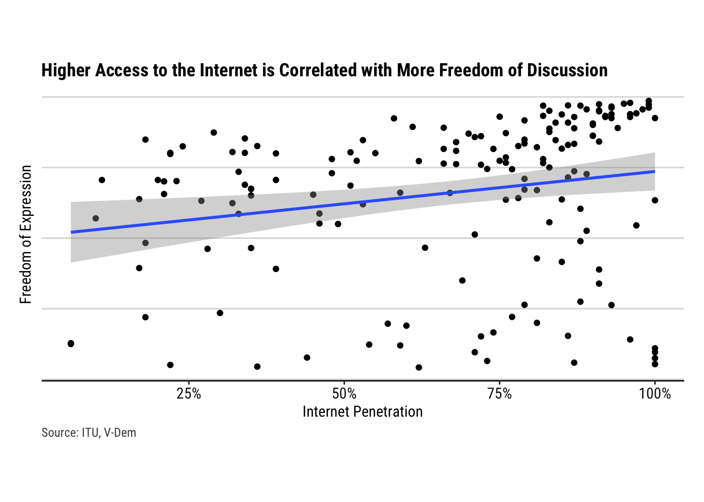<!-- -->

From this simple scatterplot, and the linear regression fitted to the
data, it seems that countries with higher levels of Internet penetration
are associated with higher levels of freedom of discussion.

However, an important omitted variable bias could emerge when ignoring
regime type. Indeed, democracies, usually characterized by high levels
of freedom of discussion, are also often more developed than
authoritarian regimes, and therefore have higher Internet penetration
rates on average.

The next step taken to analyze the relationship between Internet
penetration and freedom of discussion is to take regime type into
account. To reach this objective, we will use V-Dem’s Regimes of the
World (RoW) classification mentioned above.

``` r
freedom_speech_internet_facet <- ggplot(df_reduced, aes(x = most_recent_perc, y = v2x_freexp_altinf))+
  geom_point()+
  facet_wrap(~ regime_type)+
  geom_smooth(method = "lm")+
  
  theme(aspect.ratio = 4/7,
        text=element_text(family="Roboto Condensed"),
        plot.margin = margin(t = 0, r = 0.5, b = 0, l = 0.5, unit = "cm"),
        plot.background = element_rect(fill = "white"),
        panel.background = element_rect(fill = "white"),
        panel.grid.major.x = element_blank(),
        panel.grid.minor.x = element_blank(),
        panel.grid.major.y = element_line(color = "#dcdbd8"),
        panel.grid.minor.y = element_blank(),
        plot.title = element_text(size = rel(1.2), hjust = 0, face = "bold"),
        plot.caption = element_text(hjust = 0, size = 9, colour = "#4B4B4B"),
        axis.text = element_text(size = rel(1), color = "gray8"),
        axis.text.y = element_blank(),
        axis.line.x  = element_line(color = "gray8"),
        axis.ticks.y = element_blank())+
  scale_x_continuous(name ="Internet Penetration",labels = scales::percent_format(accuracy = 1))+
  scale_y_continuous(name = "Freedom of Expression")+
  labs(title = "Relationship between Internet Penetration and Freedom of Discussion \n depending on the regime type",
       caption="Source: ITU, V-Dem")

freedom_speech_internet_facet
```

    ## `geom_smooth()` using formula = 'y ~ x'

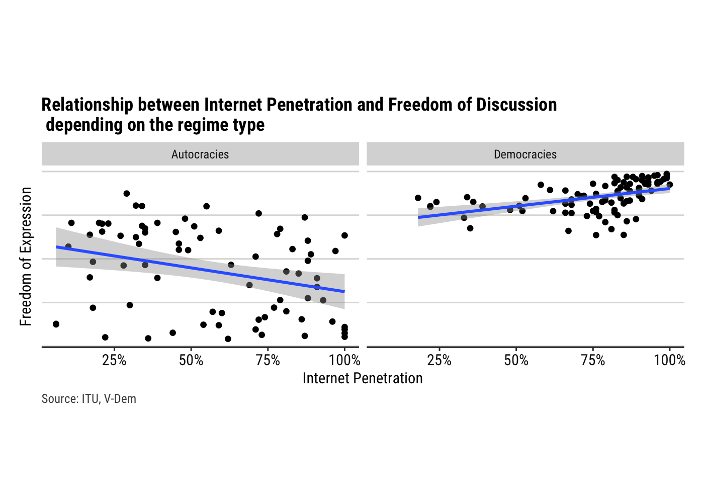<!-- -->

This faceted graph carries some very interesting information! It
suggests that the effect of Internet penetration on freedom of
discussion is **conditional on regime type**. In countries classified as
democratic, higher access to the Internet seems to be correlated with an
increase in freedom of discussion. On the other hand, countries
classified as autocracies display an apparent negative relationship
between Internet penetration and freedom of discussion.

``` r
library(sjPlot)
```

    ## Learn more about sjPlot with 'browseVignettes("sjPlot")'.

``` r
model1 <- lm(data = df_renamed,  `Freedom of Expression and Alternative Sources of Information` ~ `Internet access (%)` * `Regime type`)

tab_model(model1)
```

<table style="border-collapse:collapse; border:none;">
<tr>
<th style="border-top: double; text-align:center; font-style:normal; font-weight:bold; padding:0.2cm;  text-align:left; ">
 
</th>
<th colspan="3" style="border-top: double; text-align:center; font-style:normal; font-weight:bold; padding:0.2cm; ">
Freedom of Expression and<br>Alternative Sources of<br>Information
</th>
</tr>
<tr>
<td style=" text-align:center; border-bottom:1px solid; font-style:italic; font-weight:normal;  text-align:left; ">
Predictors
</td>
<td style=" text-align:center; border-bottom:1px solid; font-style:italic; font-weight:normal;  ">
Estimates
</td>
<td style=" text-align:center; border-bottom:1px solid; font-style:italic; font-weight:normal;  ">
CI
</td>
<td style=" text-align:center; border-bottom:1px solid; font-style:italic; font-weight:normal;  ">
p
</td>
</tr>
<tr>
<td style=" padding:0.2cm; text-align:left; vertical-align:top; text-align:left; ">
(Intercept)
</td>
<td style=" padding:0.2cm; text-align:left; vertical-align:top; text-align:center;  ">
58.47
</td>
<td style=" padding:0.2cm; text-align:left; vertical-align:top; text-align:center;  ">
49.76 – 67.19
</td>
<td style=" padding:0.2cm; text-align:left; vertical-align:top; text-align:center;  ">
<strong>\<0.001</strong>
</td>
</tr>
<tr>
<td style=" padding:0.2cm; text-align:left; vertical-align:top; text-align:left; ">
Internet access (%)
</td>
<td style=" padding:0.2cm; text-align:left; vertical-align:top; text-align:center;  ">
-0.27
</td>
<td style=" padding:0.2cm; text-align:left; vertical-align:top; text-align:center;  ">
-0.41 – -0.13
</td>
<td style=" padding:0.2cm; text-align:left; vertical-align:top; text-align:center;  ">
<strong>\<0.001</strong>
</td>
</tr>
<tr>
<td style=" padding:0.2cm; text-align:left; vertical-align:top; text-align:left; ">
Regime type \[Democracies\]
</td>
<td style=" padding:0.2cm; text-align:left; vertical-align:top; text-align:center;  ">
11.58
</td>
<td style=" padding:0.2cm; text-align:left; vertical-align:top; text-align:center;  ">
-5.24 – 28.40
</td>
<td style=" padding:0.2cm; text-align:left; vertical-align:top; text-align:center;  ">
0.176
</td>
</tr>
<tr>
<td style=" padding:0.2cm; text-align:left; vertical-align:top; text-align:left; ">
Internet access (%) ×<br>Regime type \[Democracies\]
</td>
<td style=" padding:0.2cm; text-align:left; vertical-align:top; text-align:center;  ">
0.47
</td>
<td style=" padding:0.2cm; text-align:left; vertical-align:top; text-align:center;  ">
0.25 – 0.70
</td>
<td style=" padding:0.2cm; text-align:left; vertical-align:top; text-align:center;  ">
<strong>\<0.001</strong>
</td>
</tr>
<tr>
<td style=" padding:0.2cm; text-align:left; vertical-align:top; text-align:left; padding-top:0.1cm; padding-bottom:0.1cm; border-top:1px solid;">
Observations
</td>
<td style=" padding:0.2cm; text-align:left; vertical-align:top; padding-top:0.1cm; padding-bottom:0.1cm; text-align:left; border-top:1px solid;" colspan="3">
166
</td>
</tr>
<tr>
<td style=" padding:0.2cm; text-align:left; vertical-align:top; text-align:left; padding-top:0.1cm; padding-bottom:0.1cm;">
R<sup>2</sup> / R<sup>2</sup> adjusted
</td>
<td style=" padding:0.2cm; text-align:left; vertical-align:top; padding-top:0.1cm; padding-bottom:0.1cm; text-align:left;" colspan="3">
0.626 / 0.619
</td>
</tr>
</table>

The purpose of this report is to delve into the complex interplay
between Internet penetration, freedom of speech, and regime type. By
analyzing the data and conducting case studies, this report aims to
investigate the specific mechanisms that drive these observed patterns.
By doing so, it aims to provide insights into the nuances of the
relationship between the Internet and freedom of speech in different
political contexts.

### Online activity

#### Democracies:

##### A Platform to Share Opinions and Speak Out in Safety…

In democracies, social media has provided a platform for individuals to
share their opinions and engage in political discussions, allowing for
greater freedom of expression and a more direct connection with their
representatives. The inter-connectivity and anonymity provided by the
Internet can also empower groups that tend to be discriminated against
to express themselves.

``` r
df_democracies <- df_renamed%>%
  filter(`Regime type` == "Democracies")


model_democracies_men <- lm(data = df_democracies,  `Freedom of discussion for men` ~ `Internet access (%)` + `Regime classification`)
model_democracies_women <- lm(data = df_democracies,  `Freedom of discussion for women` ~ `Internet access (%)` + `Regime classification`)

tab_model(model_democracies_men, model_democracies_women)
```

<table style="border-collapse:collapse; border:none;">
<tr>
<th style="border-top: double; text-align:center; font-style:normal; font-weight:bold; padding:0.2cm;  text-align:left; ">
 
</th>
<th colspan="3" style="border-top: double; text-align:center; font-style:normal; font-weight:bold; padding:0.2cm; ">
Freedom of discussion for<br>men
</th>
<th colspan="3" style="border-top: double; text-align:center; font-style:normal; font-weight:bold; padding:0.2cm; ">
Freedom of discussion for<br>women
</th>
</tr>
<tr>
<td style=" text-align:center; border-bottom:1px solid; font-style:italic; font-weight:normal;  text-align:left; ">
Predictors
</td>
<td style=" text-align:center; border-bottom:1px solid; font-style:italic; font-weight:normal;  ">
Estimates
</td>
<td style=" text-align:center; border-bottom:1px solid; font-style:italic; font-weight:normal;  ">
CI
</td>
<td style=" text-align:center; border-bottom:1px solid; font-style:italic; font-weight:normal;  ">
p
</td>
<td style=" text-align:center; border-bottom:1px solid; font-style:italic; font-weight:normal;  ">
Estimates
</td>
<td style=" text-align:center; border-bottom:1px solid; font-style:italic; font-weight:normal;  ">
CI
</td>
<td style=" text-align:center; border-bottom:1px solid; font-style:italic; font-weight:normal;  col7">
p
</td>
</tr>
<tr>
<td style=" padding:0.2cm; text-align:left; vertical-align:top; text-align:left; ">
(Intercept)
</td>
<td style=" padding:0.2cm; text-align:left; vertical-align:top; text-align:center;  ">
108.27
</td>
<td style=" padding:0.2cm; text-align:left; vertical-align:top; text-align:center;  ">
54.73 – 161.81
</td>
<td style=" padding:0.2cm; text-align:left; vertical-align:top; text-align:center;  ">
<strong>\<0.001</strong>
</td>
<td style=" padding:0.2cm; text-align:left; vertical-align:top; text-align:center;  ">
97.58
</td>
<td style=" padding:0.2cm; text-align:left; vertical-align:top; text-align:center;  ">
43.26 – 151.91
</td>
<td style=" padding:0.2cm; text-align:left; vertical-align:top; text-align:center;  col7">
<strong>0.001</strong>
</td>
</tr>
<tr>
<td style=" padding:0.2cm; text-align:left; vertical-align:top; text-align:left; ">
Internet access (%)
</td>
<td style=" padding:0.2cm; text-align:left; vertical-align:top; text-align:center;  ">
1.00
</td>
<td style=" padding:0.2cm; text-align:left; vertical-align:top; text-align:center;  ">
0.24 – 1.76
</td>
<td style=" padding:0.2cm; text-align:left; vertical-align:top; text-align:center;  ">
<strong>0.010</strong>
</td>
<td style=" padding:0.2cm; text-align:left; vertical-align:top; text-align:center;  ">
0.85
</td>
<td style=" padding:0.2cm; text-align:left; vertical-align:top; text-align:center;  ">
0.08 – 1.62
</td>
<td style=" padding:0.2cm; text-align:left; vertical-align:top; text-align:center;  col7">
<strong>0.031</strong>
</td>
</tr>
<tr>
<td style=" padding:0.2cm; text-align:left; vertical-align:top; text-align:left; ">
Regime classification<br>\[Liberal democracy\]
</td>
<td style=" padding:0.2cm; text-align:left; vertical-align:top; text-align:center;  ">
41.39
</td>
<td style=" padding:0.2cm; text-align:left; vertical-align:top; text-align:center;  ">
10.67 – 72.11
</td>
<td style=" padding:0.2cm; text-align:left; vertical-align:top; text-align:center;  ">
<strong>0.009</strong>
</td>
<td style=" padding:0.2cm; text-align:left; vertical-align:top; text-align:center;  ">
56.28
</td>
<td style=" padding:0.2cm; text-align:left; vertical-align:top; text-align:center;  ">
25.11 – 87.46
</td>
<td style=" padding:0.2cm; text-align:left; vertical-align:top; text-align:center;  col7">
<strong>0.001</strong>
</td>
</tr>
<tr>
<td style=" padding:0.2cm; text-align:left; vertical-align:top; text-align:left; padding-top:0.1cm; padding-bottom:0.1cm; border-top:1px solid;">
Observations
</td>
<td style=" padding:0.2cm; text-align:left; vertical-align:top; padding-top:0.1cm; padding-bottom:0.1cm; text-align:left; border-top:1px solid;" colspan="3">
90
</td>
<td style=" padding:0.2cm; text-align:left; vertical-align:top; padding-top:0.1cm; padding-bottom:0.1cm; text-align:left; border-top:1px solid;" colspan="3">
90
</td>
</tr>
<tr>
<td style=" padding:0.2cm; text-align:left; vertical-align:top; text-align:left; padding-top:0.1cm; padding-bottom:0.1cm;">
R<sup>2</sup> / R<sup>2</sup> adjusted
</td>
<td style=" padding:0.2cm; text-align:left; vertical-align:top; padding-top:0.1cm; padding-bottom:0.1cm; text-align:left;" colspan="3">
0.273 / 0.257
</td>
<td style=" padding:0.2cm; text-align:left; vertical-align:top; padding-top:0.1cm; padding-bottom:0.1cm; text-align:left;" colspan="3">
0.313 / 0.297
</td>
</tr>
</table>

This regression confirms that, in democracies, as access to the internet
increases, freedom of discussion for both men and women increases in a
statistically significant manner. Also, at the same level of internet
access, liberal democracies have a higher freedom of discussion than
flawed democraies.

However, the regression analysis above also shows that, holding
democracy type constant, men gain more freedom of speech than women as
internet access increases.

##### …But that also bears discrimination and breeds polarization

Social media has also been associated with discrimination and
polarization, with algorithms and echo chambers leading to the
amplification of extreme viewpoints and the spread of misinformation.

Table 4. Unpaired two-samples t-test comparing freedom of discussion for
men and for women

<figure>
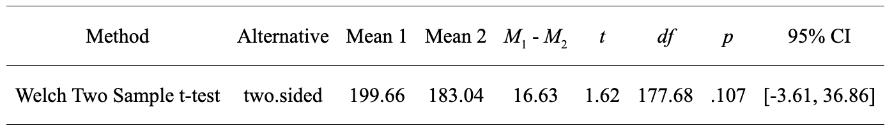
<figcaption aria-hidden="true">Table4</figcaption>
</figure>

``` r
df_democracies$countries_ordered <- factor(df_democracies$Countries, 
                                           levels = df_democracies$Countries[rev(order(df_democracies$`Freedom of discussion for men`))])


dumbbel_plot_speech <- ggplot(df_democracies%>%filter(`Regime classification` == "Liberal democracy"))+
  geom_segment(aes(x = `Freedom of discussion for women`, 
                   y = countries_ordered,
                   xend = `Freedom of discussion for men`,
                   yend = countries_ordered),
               color = "#aeb6bf", linewidth = 4.5, alpha = .5) +
  geom_point(aes(x = `Freedom of discussion for men`, y = countries_ordered), size = 4, col = "blue")+
  geom_point(aes(x = `Freedom of discussion for women`, y = countries_ordered), size = 4, col = "red")+
  
  theme(text=element_text(family="Roboto Condensed"),
        plot.margin = margin(t = 0, r = 0.5, b = 0, l = 0.5, unit = "cm"),
        plot.background = element_rect(fill = "white"),
        panel.background = element_rect(fill = "white"),
        panel.grid.major.x = element_blank(),
        panel.grid.minor.x = element_blank(),
        panel.grid.major.y = element_line(color = "#dcdbd8"),
        panel.grid.minor.y = element_blank(),
        plot.title = element_text(size = rel(1.3), hjust = 0, face = "bold"),
        plot.caption = element_text(hjust = 0, size = 9, colour = "#4B4B4B"),
        axis.text = element_text(size = rel(1), color = "gray8"),
        axis.title.y = element_blank(),
        axis.line.x  = element_line(color = "gray8"),
        axis.ticks.y = element_blank())+
  labs(title = "Gender Differences of Freedom of Discussion in Liberal Democracies ",
       caption="Source: ITU, V-Dem")
  

dumbbel_plot_speech
```

<!-- -->

#### Autocracies:

``` r
df_autocracies <- df_renamed%>%
  filter(`Regime type` == "Autocracies")
```

##### Censorship and Disinformation

At both a domestic and international level, authoritarian governments
are attempting to break up the open internet and create a network of
oppressive enclaves. This is resulting in an increasing number of
governments controlling what individuals can access and share online, by
blocking foreign websites, holding onto personal data, and centralizing
their technical infrastructure. Consequently, internet freedom globally
has decreased for the [12th year in a
row](https://freedomhouse.org/report/freedom-net/2022/countering-authoritarian-overhaul-internet).
Digital repression in many countries has increased, coinciding with
wider crackdowns on human rights. Russia, Myanmar, Libya, and Sudan
experienced the most significant declines in internet freedom.
Governments are blocking political, social, or religious content, often
targeting information sources based outside their borders, leading to
record-high online censorship. In these cases, the internet becomes a
tool for disinformation and propaganda, with governments using it to
manipulate public opinion and suppress dissent.

### Offline activity

#### Democracies:

##### A Platform for Social Change

Social media has been a powerful tool for social change in democracies,
allowing activists to raise awareness of important issues and mobilize
support for their causes.

``` r
model_democracies_offline <- lm(data = df_democracies,  `Organization through social media for citizen participation & strikes` ~ `Internet access (%)` + `Regime classification`)
summary(model_democracies_offline)
```

    ## 
    ## Call:
    ## lm(formula = `Organization through social media for citizen participation & strikes` ~ 
    ##     `Internet access (%)` + `Regime classification`, data = df_democracies)
    ## 
    ## Residuals:
    ##     Min      1Q  Median      3Q     Max 
    ## -37.593  -6.076   0.381   8.230  33.513 
    ## 
    ## Coefficients:
    ##                                          Estimate Std. Error t value Pr(>|t|)
    ## (Intercept)                              45.75191    5.80557   7.881 8.64e-12
    ## `Internet access (%)`                     0.24340    0.08206   2.966  0.00389
    ## `Regime classification`Liberal democracy -3.11818    3.33157  -0.936  0.35189
    ##                                             
    ## (Intercept)                              ***
    ## `Internet access (%)`                    ** 
    ## `Regime classification`Liberal democracy    
    ## ---
    ## Signif. codes:  0 '***' 0.001 '**' 0.01 '*' 0.05 '.' 0.1 ' ' 1
    ## 
    ## Residual standard error: 12.51 on 87 degrees of freedom
    ## Multiple R-squared:  0.09981,    Adjusted R-squared:  0.07912 
    ## F-statistic: 4.823 on 2 and 87 DF,  p-value: 0.01032

##### The dangers of certain discourses

However, certain discourses on social media can also be harmful and
perpetuate hate speech and discriminatory attitudes.

One example of the harmful effects of social media discourse can be seen
in the January 6 US Capitol attack. The event was largely organized on
social media sites used by the far-right, such as Gab and Parler. These
platforms allowed users to freely share extremist views and conspiracy
theories, ultimately leading to the violent and destructive event.

However, the negative impacts of certain discourses on social media
extend beyond just the organization of events like the Capitol attack.
Some individuals use social media to spread misinformation and
propaganda, which can fuel prejudice and intolerance towards
marginalized groups. For instance, anti-vaccine sentiment has been
amplified on social media, leading to a rise in vaccine hesitancy and
potentially putting public health at risk.

Similarly, social media can also be a breeding ground for cyberbullying
and harassment. The anonymity provided by social media can embolden
individuals to engage in abusive behavior towards others. This can lead
to serious emotional and psychological harm for those targeted by the
harassment.

#### Autocracies:

Unlike democracies, autocracies vastly differ in their access to the
Internet, monitoring or disinformation capacity, and strategies. It
could be interesting to run a cluster analysis on them, which could
enable us to group them depending on their characteristics.

First, let’s create our dataframe, and normalize the data.

``` r
df_cluster_autocracies <- df_transformed%>%
  filter(regime_type == "Autocracies")%>%
  select(-v2x_regime, -regime_type)

# Select the columns to be used for clustering
cluster_cols <- c("most_recent_perc", "v2x_freexp_altinf", "v2mecenefi", "v2smgovdom", "v2smgovfilcap", "v2smgovfilprc", "v2smgovshutcap", "v2smgovshut", "v2smgovsmmon", "v2smgovsmcenprc", "v2smarrest")

# Scale the data
normalized_data_autocracies <- scale(df_cluster_autocracies[, cluster_cols])
```

We can now create a covariance matrix, and use a heatmap to visualize
correlation between the variables.

``` r
library(ggcorrplot)

corr_matrix <- cor(normalized_data_autocracies)
ggcorrplot(corr_matrix)
```

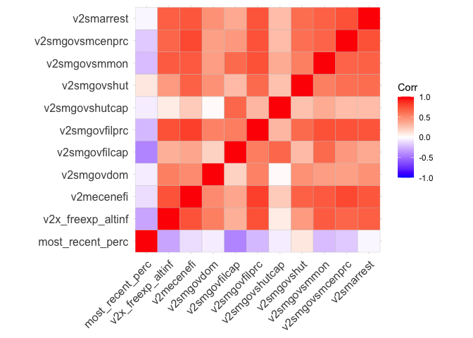<!-- -->

We can now conduct our principle components analysis. In PCA, a new set
of dimensions or latent variables are constructed based on a (linear)
combination of the original features; this is a process called **feature
extraction**.

``` r
library("FactoMineR")
library("factoextra")
```

    ## Welcome! Want to learn more? See two factoextra-related books at https://goo.gl/ve3WBa

``` r
data.pca <- princomp(corr_matrix)
summary(data.pca)
```

    ## Importance of components:
    ##                           Comp.1    Comp.2     Comp.3     Comp.4     Comp.5
    ## Standard deviation     0.8338489 0.4537099 0.22759346 0.16262333 0.10646287
    ## Proportion of Variance 0.6857717 0.2030306 0.05108865 0.02608378 0.01117895
    ## Cumulative Proportion  0.6857717 0.8888023 0.93989094 0.96597472 0.97715368
    ##                             Comp.6      Comp.7      Comp.8      Comp.9
    ## Standard deviation     0.092002574 0.075957915 0.061085782 0.059282605
    ## Proportion of Variance 0.008348429 0.005690506 0.003680316 0.003466246
    ## Cumulative Proportion  0.985502105 0.991192611 0.994872927 0.998339173
    ##                            Comp.10      Comp.11
    ## Standard deviation     0.041035510 7.708306e-09
    ## Proportion of Variance 0.001660827 5.860339e-17
    ## Cumulative Proportion  1.000000000 1.000000e+00

Each component explains a percentage of the total variance in the data
set. In the Cumulative Proportion section, the first principal component
explains over 68% of the total variance. This implies that over 2 thirds
of the data in the set of 11 variables can be represented by just the
first principal component. The second one explains 20% of the total
variance.

The cumulative proportion of Comp.1 and Comp.2 explains almost 89% of
the total variance. This means that the first two principal components
can accurately represent the data.

We can now analyze the loadings, which describe the importance of the
independent variables. The loadings provide information about which
variables give the largest contribution to the components.

- Loadings range from -1 to 1.
- A high absolute value describes that the variable strongly influences
  the component. Values close to 0 indicate that the variable has a weak
  influence on the component.
- The sign of a loading indicates whether a variable and a principal
  component are positively or negatively correlated.

``` r
data.pca$loadings[, 1:2]
```

    ##                        Comp.1      Comp.2
    ## most_recent_perc   0.37623012  0.32065342
    ## v2x_freexp_altinf -0.39005526  0.18899508
    ## v2mecenefi        -0.33504300  0.17702822
    ## v2smgovdom        -0.20144290  0.31893528
    ## v2smgovfilcap     -0.25974323 -0.55878461
    ## v2smgovfilprc     -0.36958206  0.03321707
    ## v2smgovshutcap    -0.03342861 -0.58378324
    ## v2smgovshut       -0.18858628  0.18838085
    ## v2smgovsmmon      -0.33916418 -0.09178591
    ## v2smgovsmcenprc   -0.34005071  0.07902336
    ## v2smarrest        -0.28647549  0.15524289

**Biplot of the attributes**

With the biplot, it is possible to visualize the similarities and
dissimilarities between the samples, and further shows the impact of
each attribute on each of the principal components.

``` r
# Graph of the variables
fviz_pca_var(data.pca, col.var = "black")
```

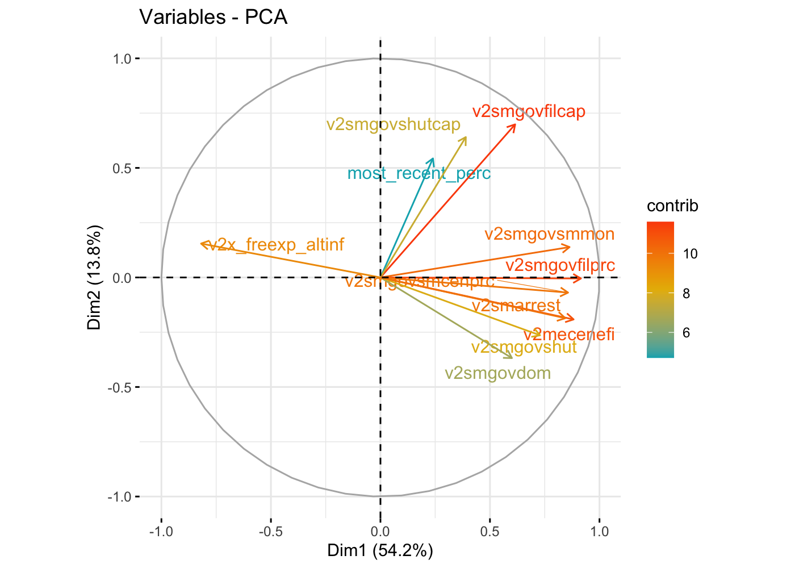<!-- --> Three main
pieces of information can be observed from the previous plot.

- First, all the variables that are grouped together are positively
  correlated to each other, and that is the case for instance where most
  government actions to limit access to the Internet are correlated with
  a lower freedom of expression.
- Then, the higher the distance between the variable and the origin, the
  better represented that variable is.
- Finally, variables that are negatively correlated are displayed to the
  opposite sides of the biplot’s origin.

**Contribution of each variable**

The goal of the third visualization is to determine how much each
variable is represented in a given component. Such a quality of
representation is called the Cos2 and corresponds to the square cosine,
and it is computed using the fviz_cos2 function.

- A low value means that the variable is not perfectly represented by
  that component.
- A high value, on the other hand, means a good representation of the
  variable on that component.

``` r
fviz_cos2(data.pca, choice = "var", axes = 1:2)
```

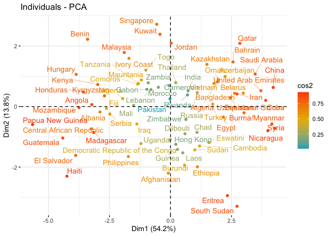<!-- --> From the
illustration above, Internet access, freedom of expression, social media
filtering capacity, and in practice are the top four variables with the
highest cos2, hence contributing the most to PC1 and PC2.

**Biplot combined with cos2**

The last two visualization approaches: biplot and attributes importance
can be combined to create a single biplot, where attributes with similar
cos2 scores will have similar colors. This is achieved by fine-tuning
the fviz_pca_var function as follows:

``` r
fviz_pca_var(data.pca, col.var = "cos2",
            gradient.cols = c("black", "orange", "green"),
            repel = TRUE)
```

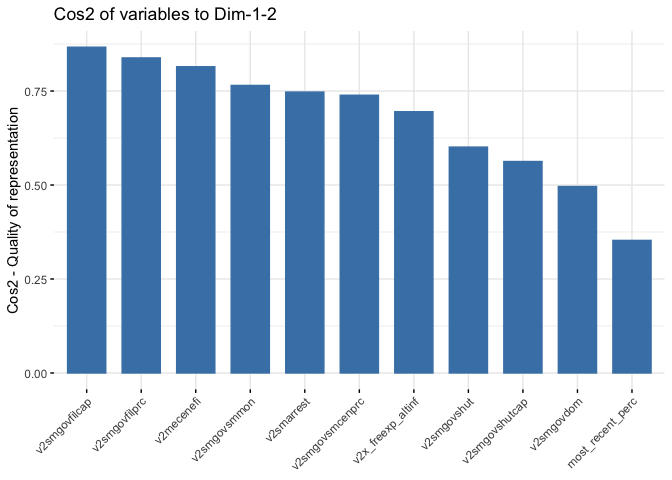<!-- --> From the
biplot below:

- High cos2 attributes are colored in green.
- Mid cos2 attributes have an orange color.
- Finally, low cos2 attributes have a black color: social media shutdown
  in practice.

**K-means clustering**

We can identify the clusters of autocracies with k-means. For getting
started, let’s try performing k-means by setting 3 clusters and nstart
equal to 20. This last parameter is needed to run k-means with 20
different random starting assignments and, then, R will automatically
choose the best results total within-cluster sum of squares.

``` r
# Run k-means clustering with the chosen number of clusters
num_clusters <- 3
set.seed(123)

kmeans_result_autocracies <- kmeans(normalized_data_autocracies, centers = num_clusters, nstart = 20)

# Add the cluster assignments to the original dataframe
df_cluster_autocracies$cluster <- kmeans_result_autocracies$cluster

kmeans_result_autocracies
```

    ## K-means clustering with 3 clusters of sizes 19, 26, 31
    ## 
    ## Cluster means:
    ##   most_recent_perc v2x_freexp_altinf v2mecenefi v2smgovdom v2smgovfilcap
    ## 1       -0.1380753         0.8699971  1.1483939  0.6613585   0.916975959
    ## 2        0.4852483        -1.0656933 -0.9382701 -0.7481767  -0.665970300
    ## 3       -0.3223557         0.3605832  0.0830819  0.2221543  -0.003461788
    ##   v2smgovfilprc v2smgovshutcap v2smgovshut v2smgovsmmon v2smgovsmcenprc
    ## 1    1.18517507      0.7857531  1.10891096    1.0516691      1.22620429
    ## 2   -0.98072470     -0.3536690 -0.69243737   -0.9924404     -0.83817565
    ## 3    0.09614567     -0.1849650 -0.09890118    0.1877980     -0.04855854
    ##    v2smarrest
    ## 1  1.24081677
    ## 2 -0.82220417
    ## 3 -0.07091001
    ## 
    ## Clustering vector:
    ##  [1] 3 1 2 1 2 2 2 2 1 3 2 3 1 3 2 3 2 3 3 3 2 1 2 2 2 3 1 3 1 3 1 1 3 1 3 2 3 3
    ## [39] 2 1 3 1 3 3 1 1 3 3 3 1 2 2 1 2 3 1 1 2 2 3 2 1 3 2 3 2 3 3 3 2 3 2 2 2 3 3
    ## 
    ## Within cluster sum of squares by cluster:
    ## [1] 101.9928 133.7588 185.7730
    ##  (between_SS / total_SS =  48.9 %)
    ## 
    ## Available components:
    ## 
    ## [1] "cluster"      "centers"      "totss"        "withinss"     "tot.withinss"
    ## [6] "betweenss"    "size"         "iter"         "ifault"

From the output, we can observe that three different clusters have been
found with sizes 19, 26 and 31.

The best way to find the best model is to try different models with a
different number of clusters. This procedure needs to be tracked using a
graphical representation, called **scree plot**, in which the number of
clusters is plotted on the x-axis, while WCSS is on the y-axis.

In this case study, we build 10 k-means models, each of these will have
a different number of clusters, reaching a maximum of 10 clusters.
Moreover, we are going to use only a part of the dataset. So, we include
only the price and the number of reviews. To plot the scree plot, we
need to save the total within-cluster sum of squares of all the models
into the variable wss.

``` r
# Decide how many clusters to look at
n_clusters <- 10

# Initialize total within sum of squares error: wss
wss <- numeric(n_clusters)

set.seed(123)

# Look over 1 to n possible clusters
for (i in 1:n_clusters) {
  # Fit the model: km.out
  km.out <- kmeans(normalized_data_autocracies, centers = i, nstart = 20)
  # Save the within cluster sum of squares
  wss[i] <- km.out$tot.withinss
}

# Produce a scree plot
wss_df <- tibble(clusters = 1:n_clusters, wss = wss)
 
scree_plot <- ggplot(wss_df, aes(x = clusters, y = wss, group = 1)) +
    geom_point(size = 4)+
    geom_line() +
    scale_x_continuous(breaks = c(2, 4, 6, 8, 10)) +
    xlab('Number of clusters')+
    geom_hline(
        yintercept = wss, 
        linetype = 'dashed', 
        col = c(rep('#000000',3),'#FF0000', rep('#000000', 6)))

scree_plot
```

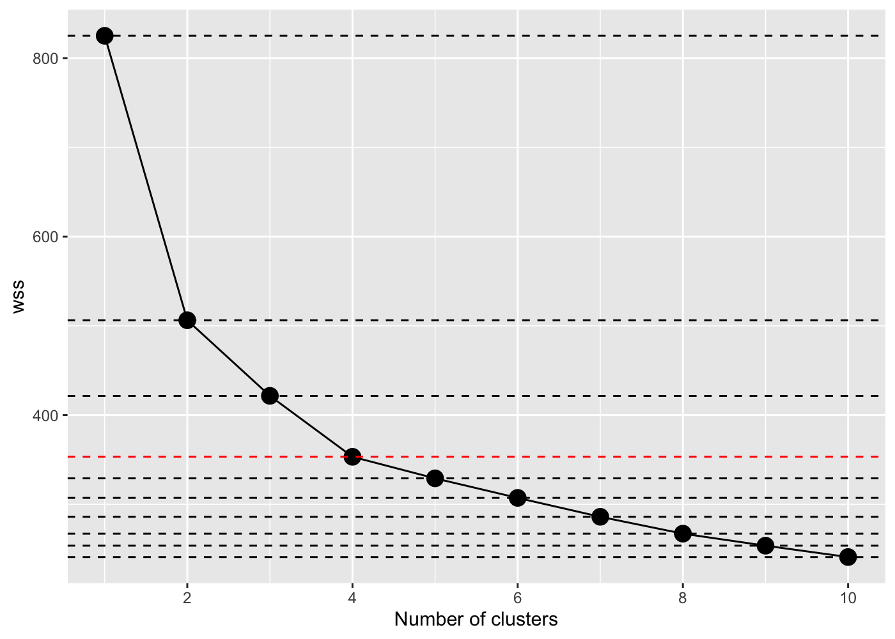<!-- --> By taking a
look at the scree plot, we can notice how the total within-cluster sum
of squares decreases as the number of clusters grows. The criterion to
choose the number of clusters is by finding an elbow such that we are
able to find a point where the WCSS decreases much slower after adding
another cluster. In this case, the best choice seems to be an number of
clusters equal to 4. After k=4, the improvements of the models seem to
reduce sharply.

Now let’s run the k-means cluster analysis with 4 clusters, and see what
information can be uncovered.

``` r
# Select number of clusters
k <- 4
set.seed(123)
# Build model with k clusters: km.out
km.out <- kmeans(normalized_data_autocracies, centers = k, nstart = 20)

# Add the cluster assignments + name to the original dataframe
df_cluster_autocracies$cluster_id <- factor(km.out$cluster)
```

Let us see what are the common characteristics of the countries of each
cluster, and if we can uncover trends and patterns in their access to
the internet and censorship strategies.

``` r
# Create a list of the variables you want to visualize
variables <- c("most_recent_perc", "v2x_freexp_altinf", "v2smgovfilcap", "v2smgovfilprc")

# Create a boxplot for each variable, colored by cluster
for (var in variables) {
  p <- ggplot(df_cluster_autocracies, aes(x = cluster_id, y = .data[[var]], fill = factor(cluster_id))) +
    geom_boxplot() +
    labs(x = "Cluster ID", y = var, fill = "Cluster") +
    theme_minimal()
  print(p)
}
```

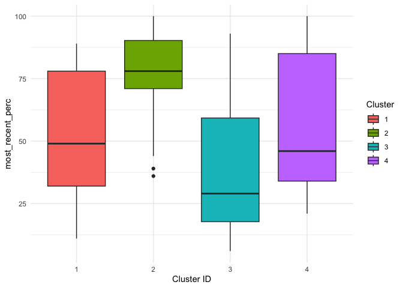<!-- -->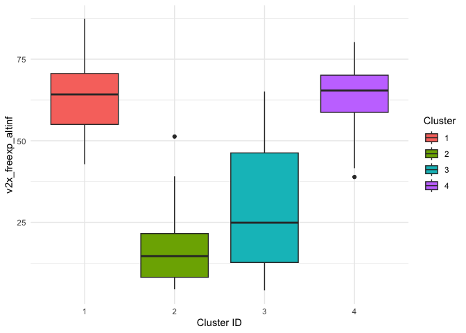<!-- -->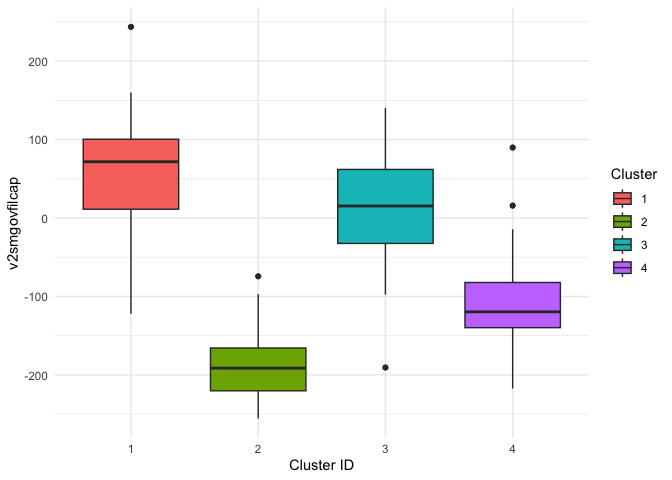<!-- -->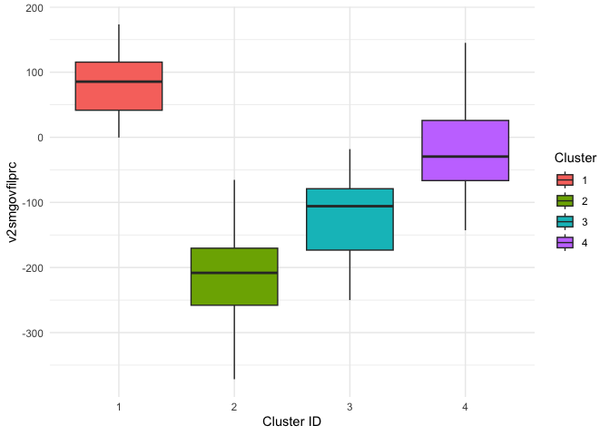<!-- -->

``` r
# Select the variables you want to plot
vars_to_plot <- c("most_recent_perc", "v2x_freexp_altinf", "v2smgovfilcap", "v2smgovfilprc")

# Create a subset of the original dataframe with only the variables to plot and the cluster information
df_subset <- df_cluster_autocracies[, c(vars_to_plot, "cluster_id", "Economy")]

# Create a scatter plot for each pair of variables, colored by cluster
for(i in 1:(length(vars_to_plot)-1)){
  for(j in (i+1):length(vars_to_plot)){
    # "!!sym()" function is used to convert the variable names from strings to symbols.
    p <- ggplot(df_subset, aes(x = !!sym(vars_to_plot[i]), y = !!sym(vars_to_plot[j]), color = factor(cluster_id))) + 
      geom_point() +
      geom_text(aes(label = Economy), hjust = 0, vjust = 0)+
      labs(x = vars_to_plot[i], y = vars_to_plot[j])
    print(p)
  }
}
```

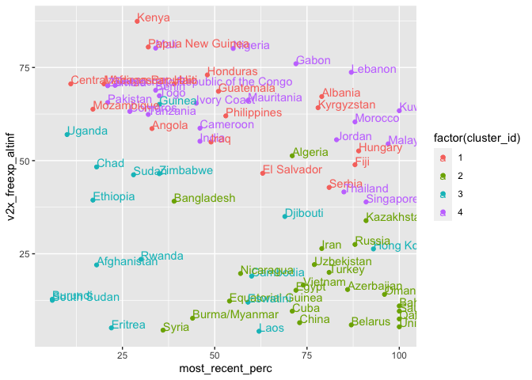<!-- --><!-- -->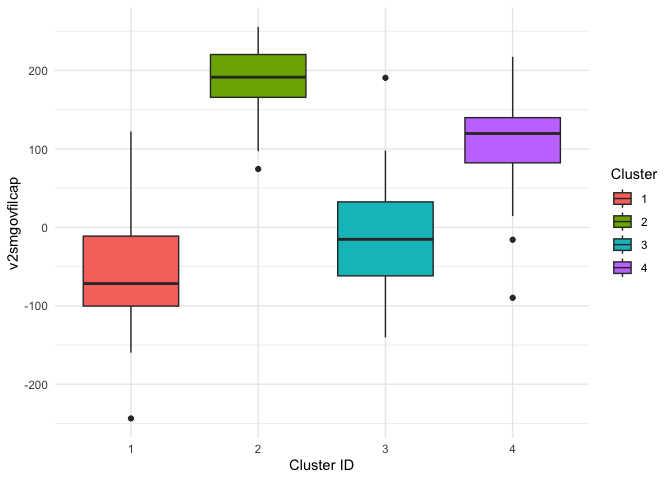<!-- -->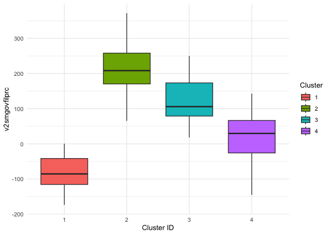<!-- -->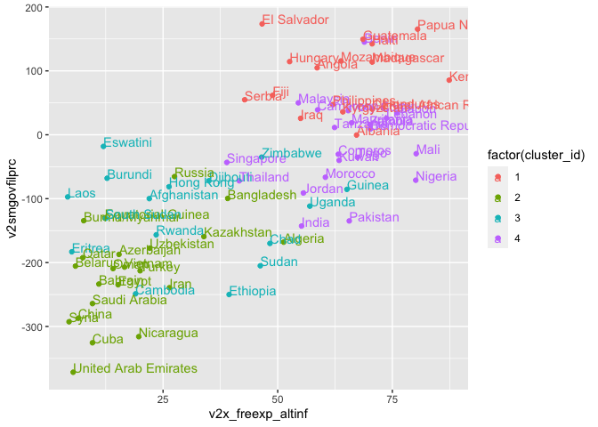<!-- -->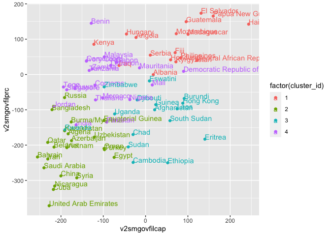<!-- -->

##### Digital repression: surveillance, harassment, and targeted violence

Let us visualize the difference in Internet shutdown capacity, and in
practice.

``` r
t_model2 <- t.test(df_autocracies$`Government Internet shutdown capacity`, df_autocracies$`Government Internet shut down in practice`)
stats.table2 <- tidy(t_model2, conf.int = TRUE)

nice_table(stats.table2, broom = "t.test")
```

<div class="tabwid"><style>.cl-d7085488{table-layout:auto;}.cl-d6fd0560{font-family:'Times New Roman';font-size:12pt;font-weight:normal;font-style:normal;text-decoration:none;color:rgba(0, 0, 0, 1.00);background-color:transparent;}.cl-d6fd056a{font-family:'Times New Roman';font-size:12pt;font-weight:normal;font-style:italic;text-decoration:none;color:rgba(0, 0, 0, 1.00);background-color:transparent;}.cl-d6fd0574{font-family:'Times New Roman';font-size:7.2pt;font-weight:normal;font-style:normal;text-decoration:none;color:rgba(0, 0, 0, 1.00);background-color:transparent;position: relative;top:3.6pt;}.cl-d7012d20{margin:0;text-align:center;border-bottom: 0 solid rgba(0, 0, 0, 1.00);border-top: 0 solid rgba(0, 0, 0, 1.00);border-left: 0 solid rgba(0, 0, 0, 1.00);border-right: 0 solid rgba(0, 0, 0, 1.00);padding-bottom:5pt;padding-top:5pt;padding-left:5pt;padding-right:5pt;line-height: 2;background-color:transparent;}.cl-d7014850{background-color:transparent;vertical-align: middle;border-bottom: 0.5pt solid rgba(0, 0, 0, 1.00);border-top: 0.5pt solid rgba(0, 0, 0, 1.00);border-left: 0 solid rgba(0, 0, 0, 1.00);border-right: 0 solid rgba(0, 0, 0, 1.00);margin-bottom:0;margin-top:0;margin-left:0;margin-right:0;}.cl-d701485a{background-color:transparent;vertical-align: middle;border-bottom: 0.5pt solid rgba(0, 0, 0, 1.00);border-top: 0 solid rgba(0, 0, 0, 1.00);border-left: 0 solid rgba(0, 0, 0, 1.00);border-right: 0 solid rgba(0, 0, 0, 1.00);margin-bottom:0;margin-top:0;margin-left:0;margin-right:0;}</style><table data-quarto-disable-processing='true' class='cl-d7085488'><thead><tr style="overflow-wrap:break-word;"><th class="cl-d7014850"><p class="cl-d7012d20"><span class="cl-d6fd0560">Method</span></p></th><th class="cl-d7014850"><p class="cl-d7012d20"><span class="cl-d6fd0560">Alternative</span></p></th><th class="cl-d7014850"><p class="cl-d7012d20"><span class="cl-d6fd0560">Mean 1</span></p></th><th class="cl-d7014850"><p class="cl-d7012d20"><span class="cl-d6fd0560">Mean 2</span></p></th><th class="cl-d7014850"><p class="cl-d7012d20"><span class="cl-d6fd056a">M</span><span class="cl-d6fd0574">1</span><span class="cl-d6fd0560"> - </span><span class="cl-d6fd056a">M</span><span class="cl-d6fd0574">2</span></p></th><th class="cl-d7014850"><p class="cl-d7012d20"><span class="cl-d6fd056a">t</span></p></th><th class="cl-d7014850"><p class="cl-d7012d20"><span class="cl-d6fd056a">df</span></p></th><th class="cl-d7014850"><p class="cl-d7012d20"><span class="cl-d6fd056a">p</span></p></th><th class="cl-d7014850"><p class="cl-d7012d20"><span class="cl-d6fd0560">95% CI</span></p></th></tr></thead><tbody><tr style="overflow-wrap:break-word;"><td class="cl-d701485a"><p class="cl-d7012d20"><span class="cl-d6fd0560">Welch Two Sample t-test</span></p></td><td class="cl-d701485a"><p class="cl-d7012d20"><span class="cl-d6fd0560">two.sided</span></p></td><td class="cl-d701485a"><p class="cl-d7012d20"><span class="cl-d6fd0560">-73.47</span></p></td><td class="cl-d701485a"><p class="cl-d7012d20"><span class="cl-d6fd0560">-25.57</span></p></td><td class="cl-d701485a"><p class="cl-d7012d20"><span class="cl-d6fd0560">-47.91</span></p></td><td class="cl-d701485a"><p class="cl-d7012d20"><span class="cl-d6fd0560">-2.54</span></p></td><td class="cl-d701485a"><p class="cl-d7012d20"><span class="cl-d6fd0560">145.44</span></p></td><td class="cl-d701485a"><p class="cl-d7012d20"><span class="cl-d6fd0560">.012</span></p></td><td class="cl-d701485a"><p class="cl-d7012d20"><span class="cl-d6fd0560">[-85.17, -10.64]</span></p></td></tr></tbody></table></div>

**Key takeaway**: Autocracies tend not to leverage their Internet
shutdown capacity to the fullest.

Why not?

In autocracies, the internet is increasingly being used as a tool of
repression. Governments are using digital means such as surveillance,
social media monitoring, and targeted violence to silence dissent and
suppress political opposition. Activists and human rights defenders face
heightened risks both on- and offline, as governments increasingly use
technology to monitor and track their activities. Harassment and cyber
attacks against individuals and groups critical of the government are
also on the rise. In some cases, governments are using the internet to
specifically target vulnerable populations, such as ethnic and religious
minorities, and subject them to online abuse and persecution. The impact
of digital repression on individuals and society as a whole is
significant, as it undermines freedom of expression and other basic
human rights, and contributes to a culture of fear and self-censorship.

##### The Internet for social change

In autocratic regimes, and despite the dangers such actions bears, the
internet has also been a platform for social change. Citizens in
authoritarian states often use it to document and expose human rights
abuses, corruption, and government repression. Social media has allowed
activists and ordinary citizens to share videos, photos, and other
evidence of abuses, bypassing traditional state-controlled media
outlets. This has helped to bring international attention to human
rights issues and put pressure on authoritarian governments to change
their behavior.

``` r
df_offline_activity <-  df %>% 
  select(v2x_regime,  #regime classification (4)
         v2smorgavgact, #Average people’s use of social media to organize offline action
         v2smorgelitact, #Elites’ use of social media to organize offline action
         #Types of organization through social media
         v2smorgtypes_0, #Petition signing
         v2smorgtypes_1, #Voter turnout 
         v2smorgtypes_2, #Street protests
         v2smorgtypes_3, #Strikes/labor actions
         v2smorgtypes_4, #Riots
         v2smorgtypes_5, #Organised rebellion
         v2smorgtypes_6) %>%#Vigilante Justice
  mutate(#recode sm. org. type --> merge categories
         smorg_particip = round((v2smorgtypes_0 + v2smorgtypes_1 + v2smorgtypes_3)/3, 3), #citizen participation & strikes
         v2x_regime = as.factor(v2x_regime))%>%
  select(-v2smorgtypes_0, -v2smorgtypes_1, -v2smorgtypes_3) %>% 
  mutate_if(is.numeric, ~ . * 100) %>% 
  group_by(v2x_regime) %>%
  summarise(avg_ppl_use = mean(v2smorgavgact),
            elites_use = mean(v2smorgelitact), 
            citizen_particip = mean(smorg_particip),
            st_protests = mean(v2smorgtypes_2),
            riots = mean(v2smorgtypes_4), 
            org_rebellion = mean(v2smorgtypes_5),
            vigi_justice = mean(v2smorgtypes_6))

df_offline_long <- gather(df_offline_activity, key = "variable", value = "value", -v2x_regime, -avg_ppl_use, -elites_use)
```

``` r
offline_activity <- ggplot(df_offline_long, aes(x = v2x_regime, y = value, fill = variable)) +
  geom_col(position = "fill", color = "white") +
  labs(x = "Regime Type", y = "Value", fill = "Variable") +
  scale_fill_manual(values = c("citizen_particip" = "#0072B2", "st_protests" = "#009E73",
                               "riots" = "#D55E00", "org_rebellion" = "#CC79A7",
                               "vigi_justice" = "#56B4E9")) +
  theme(text=element_text(family="Roboto Condensed"),
        plot.margin = margin(t = 0, r = 0.5, b = 0, l = 0.5, unit = "cm"),
        plot.background = element_rect(fill = "white"),
        panel.background = element_rect(fill = "white"),
        panel.grid.major.x = element_blank(),
        panel.grid.minor.x = element_blank(),
        panel.grid.major.y = element_line(color = "#dcdbd8"),
        panel.grid.minor.y = element_blank(),
        plot.title = element_text(size = rel(1.3), hjust = 0, face = "bold"),
        plot.caption = element_text(hjust = 0, size = 9, colour = "#4B4B4B"),
        axis.text = element_text(size = rel(1), color = "gray8"),
        axis.title= element_blank(),
        axis.line.x  = element_line(color = "gray8"),
        axis.ticks.y = element_blank(),
        axis.text.y = element_blank())+
  labs(title = "Nature of organisation through social media, across regime types",
       caption="Source: ITU, V-Dem")


offline_activity
```

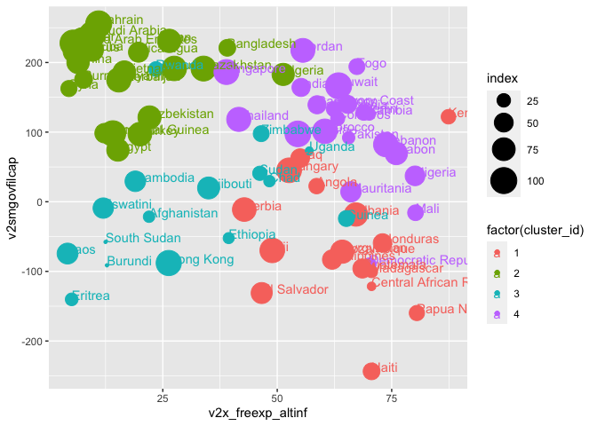<!-- -->

Resources: - *<https://www.datacamp.com/tutorial/pca-analysis-r>* -
*<https://www.datacamp.com/tutorial/k-means-clustering-r>*
