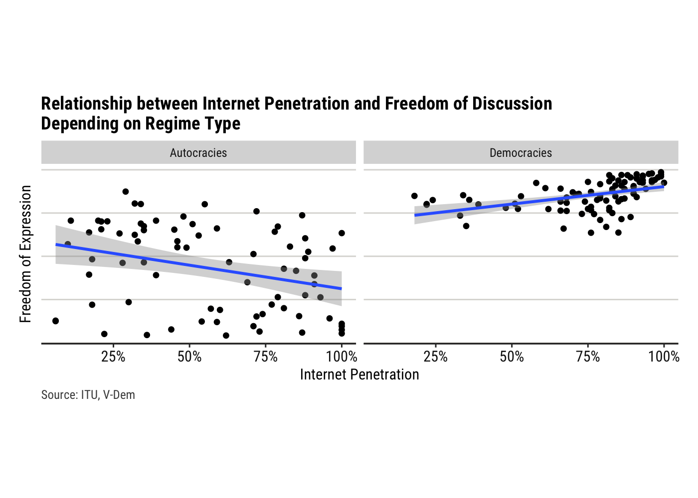

Final_Project
================
Matteo Larrode
2023-04-10

## Intro

A growing body of literature has been interested in the effect of the
rise and diffusion of new technologies on international relations. One
particular topic of contention is the relationship between internet use,
especially activity on social networks, and civil liberties.

Social media platforms have fundamentally transformed the landscape of
social and political movements. They have allowed individuals to bypass
traditional gatekeepers of information, such as the mainstream media,
and connect with each other directly. This has enabled dissidents to
spread information and organize more quickly and effectively than ever
before. The other side of the coin is that they also enabled certain
governments to better monitor and gather information, potentially
putting activists at risk.

Through a combination of data analysis and case studies, this report
seeks to further uncover the nature of the effect of the development of
the internet and social media on freedom of speech and activism.

## Dataset & Methodology

For this research project, a dataset on internet penetration, V-Dem
indicators, and the political environment of the internet and social
media was compiled for 179 countries.

- **Internet penetration**: The [International Telecommunication Union
  (ITU)](https://www.itu.int/en/Pages/default.aspx) is the UN
  specialized agency for information and communications technologies
  (ICT), and the official source for global ICT
  [statistics](https://www.itu.int/en/ITU-D/Statistics/Pages/stat/default.aspx).
  These statistics include the percentage of the population having
  access to the internet, broken down by gender and urban/rural area, at
  country level.

- **Measure of democracy**: The [Varieties of Democracy Dataset, version
  13](https://www.v-dem.net/data/the-v-dem-dataset/) measures democracy
  and many of its indicators in the set of countries studied. It also
  includes the Regimes of the World (RoW) variable that was used to
  classify regime types for this project.

- **Political environment of the internet and social media**: Through
  expert-coded surveys, the Digital Society Survey, designed by the
  [Digital Society Project](http://digitalsocietyproject.org), provides
  information on topics related to coordinated information operations,
  digital media freedom, online media polarization, social cleavages as
  well as state internet regulation capacity and approach.

#### Types of political systems

This report tackles the differences in the impact of the internet on
civil liberties, especially freedom of expression, across different
types of regimes. To classify them, we will use the Regimes of the World
(RoW) data by political scientists Anna Lührmann, Marcus Tannenberg, and
Staffan Lindberg, published by the Varieties of Democracy (V-Dem)
project. The RoW data distinguishes four types of political systems
based on how their elections work and other factors related to how their
government functions.

- closed autocracies
- electoral autocracies
- electoral democracies
- liberal democracies

One strength of using the RoW data is that it is based on evaluations by
experts, who are primarily academics, members of the media, and civil
society, and often nationals or residents of the country they assess.
This allows for a nuanced and informed assessment of a country’s
political system. Additionally, V-Dem uses several experts per country,
year, and topic, to make its assessments less subjective, which further
increases the reliability of the data.

However, a weakness of using expert evaluations is that they are to some
degree subjective, and there may be disagreement about specific
characteristics or how something as complex as a political system can be
reduced into a single measure. V-Dem addresses this by using several
experts and specific questions on completely explained scales.

Overall, the use of the RoW data is a valid and [widely accepted
approach](https://ourworldindata.org/regimes-of-the-world-data) to
measuring political regimes, and we believe it will be a useful tool for
our analysis.

## Findings

### General Findings

**Exploratory data analysis**:

<figure>

<figcaption aria-hidden="true">Table1</figcaption>
</figure>

For a first high-level overview, we used the “Freedom of Expression and
Alternative Sources of Information index” of the VDem dataset. This
variable quantifies the extent to which governments respect press and
media freedom, the freedom of ordinary people to discuss political
matters at home and in the public sphere, as well as the freedom of
academic and cultural expression.

``` r
freedom_speech_internet <- ggplot(df_reduced, aes(x = most_recent_perc, y = v2x_freexp_altinf))+
  geom_point()+
  geom_smooth(method = "lm")+
  
  theme(aspect.ratio = 3.2/7,
        text=element_text(family="Roboto Condensed"),
        plot.margin = margin(t = 0, r = 0.5, b = 0, l = 0.5, unit = "cm"),
        plot.background = element_rect(fill = "white"),
        panel.background = element_rect(fill = "white"),
        panel.grid.major.x = element_blank(),
        panel.grid.minor.x = element_blank(),
        panel.grid.major.y = element_line(color = "#dcdbd8"),
        panel.grid.minor.y = element_blank(),
        plot.title = element_text(size = rel(1.2), hjust = 0, face = "bold"),
        plot.caption = element_text(hjust = 0, size = 9, colour = "#4B4B4B"),
        axis.text = element_text(size = rel(1), color = "gray8"),
        axis.text.y = element_blank(),
        axis.line.x  = element_line(color = "gray8"),
        axis.ticks.y = element_blank())+
  scale_x_continuous(name ="Internet Penetration",labels = scales::percent_format(accuracy = 1))+
  scale_y_continuous(name = "Freedom of Expression")+
  labs(title = "Higher Access to the Internet is Correlated with More Freedom of Discussion",
       caption="Source: ITU, V-Dem")

freedom_speech_internet
```

    ## `geom_smooth()` using formula = 'y ~ x'

<!-- -->

From this simple scatterplot, and the linear regression fitted to the
data, it seems that countries with higher levels of Internet penetration
are associated with higher levels of freedom of discussion.

However, an important omitted variable bias could emerge when ignoring
regime type. Indeed, democracies, usually characterized by high levels
of freedom of discussion, are also often more developed than
authoritarian regimes, and therefore have higher Internet penetration
rates on average.

The next step taken to analyze the relationship between Internet
penetration and freedom of discussion is to take regime type into
account. To reach this objective, we will use V-Dem’s Regimes of the
World (RoW) classification mentioned above.

``` r
freedom_speech_internet_facet <- ggplot(df_reduced, aes(x = most_recent_perc, y = v2x_freexp_altinf))+
  geom_point()+
  facet_wrap(~ regime_type)+
  geom_smooth(method = "lm")+
  
  theme(aspect.ratio = 4/7,
        text=element_text(family="Roboto Condensed"),
        plot.margin = margin(t = 0, r = 0.5, b = 0, l = 0.5, unit = "cm"),
        plot.background = element_rect(fill = "white"),
        panel.background = element_rect(fill = "white"),
        panel.grid.major.x = element_blank(),
        panel.grid.minor.x = element_blank(),
        panel.grid.major.y = element_line(color = "#dcdbd8"),
        panel.grid.minor.y = element_blank(),
        plot.title = element_text(size = rel(1.2), hjust = 0, face = "bold"),
        plot.caption = element_text(hjust = 0, size = 9, colour = "#4B4B4B"),
        axis.text = element_text(size = rel(1), color = "gray8"),
        axis.text.y = element_blank(),
        axis.line.x  = element_line(color = "gray8"),
        axis.ticks.y = element_blank())+
  scale_x_continuous(name ="Internet Penetration",labels = scales::percent_format(accuracy = 1))+
  scale_y_continuous(name = "Freedom of Expression")+
  labs(title = "Relationship between Internet Penetration and Freedom of Discussion \n depending on the regime type",
       caption="Source: ITU, V-Dem")

freedom_speech_internet_facet
```

    ## `geom_smooth()` using formula = 'y ~ x'

<!-- -->

This faceted graph carries some very interesting information! It
suggests that the effect of Internet penetration on freedom of
discussion is **conditional on regime type**. In countries classified as
democratic, higher access to the Internet seems to be correlated with an
increase in freedom of discussion. On the other hand, countries
classified as autocracies display an apparent negative relationship
between Internet penetration and freedom of discussion.

``` r
model1 <- lm(data = df_reduced,  (v2x_freexp_altinf*100) ~ most_recent_perc * regime_type)

summary(model1)
```

    ## 
    ## Call:
    ## lm(formula = (v2x_freexp_altinf * 100) ~ most_recent_perc * regime_type, 
    ##     data = df_reduced)
    ## 
    ## Residuals:
    ##     Min      1Q  Median      3Q     Max 
    ## -47.380  -8.436   2.139   8.835  38.923 
    ## 
    ## Coefficients:
    ##                                         Estimate Std. Error t value Pr(>|t|)
    ## (Intercept)                               58.471      4.413  13.249  < 2e-16
    ## most_recent_perc                         -27.235      7.005  -3.888 0.000147
    ## regime_typeDemocracies                    11.580      8.519   1.359 0.175922
    ## most_recent_perc:regime_typeDemocracies   47.465     11.603   4.091 6.76e-05
    ##                                            
    ## (Intercept)                             ***
    ## most_recent_perc                        ***
    ## regime_typeDemocracies                     
    ## most_recent_perc:regime_typeDemocracies ***
    ## ---
    ## Signif. codes:  0 '***' 0.001 '**' 0.01 '*' 0.05 '.' 0.1 ' ' 1
    ## 
    ## Residual standard error: 17.17 on 162 degrees of freedom
    ## Multiple R-squared:  0.6257, Adjusted R-squared:  0.6188 
    ## F-statistic: 90.28 on 3 and 162 DF,  p-value: < 2.2e-16

``` r
# Load required package
library(cluster)

df_cluster <- df_reduced%>%
  select(-v2x_regime, -regime_type)

# Select the columns to be used for clustering
cluster_cols <- c("most_recent_perc", "v2x_freexp_altinf", "v2cldiscm", "v2cldiscw", "v2mecenefi", "v2smgovdom", "v2smgovshutcap", "v2smgovshut", "v2smgovsmmon", "v2smgovsmcenprc", "v2smarrest", "v2smorgavgact", "v2smorgelitact", "smorg_st_protests", "smorg_particip", "smorg_violence")

# Scale the data
scaled_data <- scale(df_cluster[, cluster_cols])

# Determine the optimal number of clusters (elbow method)
wss <- sapply(1:10, function(k) {
  kmeans(scaled_data, k, nstart = 10)$tot.withinss})

plot(1:10, wss, type = "b", xlab = "Number of clusters", ylab = "Within groups sum of squares")
```

<!-- -->

``` r
# Run k-means clustering with the chosen number of clusters
num_clusters <- 5
kmeans_result <- kmeans(scaled_data, centers = num_clusters, nstart = 25)

# Add the cluster assignments to the original dataframe
df_cluster$cluster <- kmeans_result$cluster
```

``` r
cluster_plot <- ggplot(df_cluster, aes(x = most_recent_perc, y = v2x_freexp_altinf, color = factor(cluster))) + 
  geom_point() +
  labs(x = "Internet Access", y = "Freedom of Speech", color = "Cluster") #+
  #geom_text(aes(label = Economy), hjust = 0, vjust = 0)

cluster_plot
```

<!-- --> The purpose
of this report is to delve into the complex interplay between Internet
penetration, freedom of speech, and regime type. By analyzing the data
and conducting case studies, this report aims to investigate the
specific mechanisms that drive these observed patterns. By doing so, it
aims to provide insights into the nuances of the relationship between
the Internet and freedom of speech in different political contexts.

### Online activity

#### Democracies:

##### A Platform to Share Opinions and Speak Out in Safety…

In democracies, social media has provided a platform for individuals to
share their opinions and engage in political discussions, allowing for
greater freedom of expression and a more direct connection with their
representatives. The inter-connectivity and anonymity provided by the
Internet can also empower groups that tend to be discriminated against
to express themselves.

VARIABLES

Freedom of Expression and Alternative Sources of Information index (D) -
(v2x_freexp_altinf) Freedom of discussion for men (C) (v2cldiscm)
Freedom of discussion for women (C) (v2cldiscw)

##### …But that also bears discrimination and breeds polarization

At the same time, social media has also been associated with
discrimination and polarization, with algorithms and echo chambers
leading to the amplification of extreme viewpoints and the spread of
misinformation.

#### Autocracies:

##### Censorship and Disinformation

At both a domestic and international level, authoritarian governments
are attempting to break up the open internet and create a network of
oppressive enclaves. This is resulting in an increasing number of
governments controlling what individuals can access and share online, by
blocking foreign websites, holding onto personal data, and centralizing
their technical infrastructure. Consequently, internet freedom globally
has decreased for the [12th year in a
row](https://freedomhouse.org/report/freedom-net/2022/countering-authoritarian-overhaul-internet).
Digital repression in many countries has increased, coinciding with
wider crackdowns on human rights. Russia, Myanmar, Libya, and Sudan
experienced the most significant declines in internet freedom.
Governments are blocking political, social, or religious content, often
targeting information sources based outside their borders, leading to
record-high online censorship. In these cases, the internet becomes a
tool for disinformation and propaganda, with governments using it to
manipulate public opinion and suppress dissent.

### Offline activity

#### Democracies:

##### A Platform for Social Change

Social media has been a powerful tool for social change in democracies,
allowing activists to raise awareness of important issues and mobilize
support for their causes.

##### The dangers of certain discourses

However, certain discourses on social media can also be harmful and
perpetuate hate speech and discriminatory attitudes.

#### Autocracies:

``` r
df_cluster_autocracies <- df_reduced%>%
  filter(regime_type == "Autocracies")%>%
  select(-v2x_regime, -regime_type)


# Scale the data
scaled_data_autocracies <- scale(df_cluster_autocracies[, cluster_cols])

# Run k-means clustering with the chosen number of clusters
num_clusters <- 3
kmeans_result_autocracies <- kmeans(scaled_data_autocracies, centers = num_clusters, nstart = 25)

# Add the cluster assignments to the original dataframe
df_cluster_autocracies$cluster <- kmeans_result_autocracies$cluster
```

``` r
# Perform PCA
pca <- prcomp(scaled_data_autocracies, center = TRUE, scale. = TRUE)
# Extract the loadings
loadings <- pca$rotation[, 1:2]
# Compute the scores
scores <- as.data.frame(pca$x[, 1:2])
# Add the Economy and cluster information
scores <- cbind(Economy = df_cluster_autocracies$Economy, 
                scores, 
                cluster = df_cluster_autocracies$cluster)


cluster_plot_autocracies <- ggplot(scores, aes(x = PC1, y = PC2, color = factor(cluster))) + 
  geom_point() +
  labs(x = "PC1", y = "PC2", color = "Cluster") +
  geom_text(aes(label = Economy), hjust = 0, vjust = 0)

cluster_plot_autocracies
```

<!-- -->

##### Digital repression: surveillance, harassment, and targeted violence

In autocracies, the internet is increasingly being used as a tool of
repression. Governments are using digital means such as surveillance,
social media monitoring, and targeted violence to silence dissent and
suppress political opposition. Activists and human rights defenders face
heightened risks both on- and offline, as governments increasingly use
technology to monitor and track their activities. Harassment and cyber
attacks against individuals and groups critical of the government are
also on the rise. In some cases, governments are using the internet to
specifically target vulnerable populations, such as ethnic and religious
minorities, and subject them to online abuse and persecution. The impact
of digital repression on individuals and society as a whole is
significant, as it undermines freedom of expression and other basic
human rights, and contributes to a culture of fear and self-censorship.

##### The Internet for social change

In autocratic regimes, and despite the dangers such actions bears, the
internet has also been a platform for social change. Citizens in
authoritarian states often use it to document and expose human rights
abuses, corruption, and government repression. Social media has allowed
activists and ordinary citizens to share videos, photos, and other
evidence of abuses, bypassing traditional state-controlled media
outlets. This has helped to bring international attention to human
rights issues and put pressure on authoritarian governments to change
their behavior.
